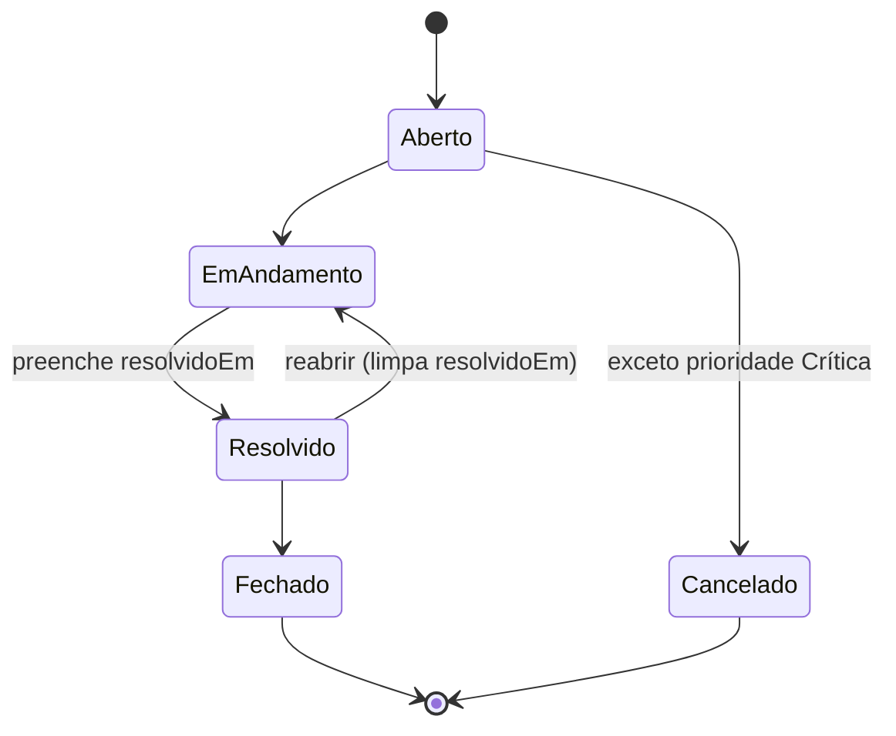
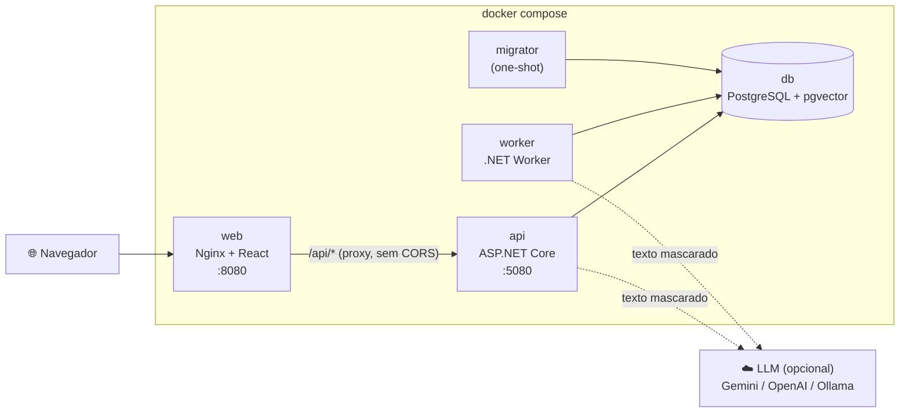

# HelpDesk Inteligente

Gestão de chamados de suporte com **triagem assistida por IA** (RAG com pgvector) e um **copiloto conversacional** para o atendente, com tool calling.

**.NET 10 · React + TypeScript · PostgreSQL + pgvector · Docker Compose**

[](https://github.com/cristianbrunone/helpdesk-inteligente/actions/workflows/ci.yml)

> 🚧 **Em desenvolvimento.** O projeto é construído em sprints incrementais, e este README cresce a cada entrega. O plano está em [`docs/05-sprints.md`](docs/05-sprints.md).
>
> **Entregue até agora:** Sprint 0 (Walking Skeleton + PoC de IA) e Sprint 1 (chamados de ponta a ponta). Veja [o que já existe](#o-que-já-existe).

## Documentação

O projeto foi planejado antes de ser codificado. Recomendo ler nesta ordem:

| Documento | Conteúdo |
|---|---|
| [`docs/JORNADA.md`](docs/JORNADA.md) | Como o projeto foi construído, fase a fase |
| [`DECISOES.md`](DECISOES.md) | Resumo das decisões técnicas e premissas |
| [`docs/01-requisitos.md`](docs/01-requisitos.md) | Requisitos funcionais, regras de negócio e NFRs |
| [`docs/02-add.md`](docs/02-add.md) | Arquitetura (C4, módulos, fluxos, topologia) |
| [`docs/03-modelo-de-dados.md`](docs/03-modelo-de-dados.md) | Modelo de dados, índices e consultas |
| [`docs/04-contratos-api.md`](docs/04-contratos-api.md) | Contratos da API |
| [`docs/adr/`](docs/adr/) | Registros de decisão de arquitetura (ADRs) |

---

## Como rodar

### Pré-requisitos

| Para | Precisa de |
|---|---|
| Rodar a aplicação | **Docker** com Docker Compose v2 (só isso) |
| Desenvolver e rodar os testes do backend | **.NET 10 SDK** (10.0.401 ou superior, ver `global.json`) e Docker (os testes de integração usam Testcontainers) |
| Desenvolver e rodar os testes do frontend | **Node.js 24 LTS** (ver `web/.nvmrc`) |

**Nenhuma chave de API é necessária.** A IA usa um provedor *fake* por padrão (ADR-0005).

### Subir tudo

```bash
docker compose up --build
```

Não é preciso criar `.env`: todo valor tem padrão no `docker-compose.yml`. A ordem de subida é automática: `db` saudável → `migrator` aplica migrations e seed (5 categorias e 200 chamados de demonstração) e termina → `api` saudável → `web`. O `worker` sobe junto com a API.

| O quê | URL |
|---|---|
| Aplicação web | http://localhost:8080 |
| Swagger (documentação interativa da API) | http://localhost:5080/swagger |
| Documento OpenAPI | http://localhost:5080/openapi/v1.json |
| Health check | http://localhost:5080/health |
| PostgreSQL (opcional, para inspeção) | `localhost:55432`, usuário e banco `helpdesk`, senha `helpdesk_dev` (só desenvolvimento) |

Para mudar alguma porta ou valor, copie o [`.env.example`](.env.example) para `.env` e edite. O `.env` nunca é versionado (ADR-0023).

<details>
<summary><b>Rede corporativa com inspeção TLS</b> (o build falha com <code>UntrustedRoot</code> ou <code>NU1301</code>)</summary>

Alguns proxies corporativos interceptam HTTPS e reassinam os certificados. A máquina confia na CA do proxy, mas os contêineres de build não, e o `dotnet restore` ou o `npm ci` falham dentro do Docker.

1. Exporte a CA raiz do proxy em formato PEM para um caminho **fora do repositório**. No Windows: `certmgr.msc` → Autoridades de Certificação Raiz Confiáveis → exportar como "Base-64 X.509".
2. No seu `.env`, adicione: `CA_EXTRA_PEM=C:/caminho/para/ca-corporativa.pem`.
3. Rode `docker compose up --build` normalmente.

A CA é passada como *build secret* e vale **só durante o build**: as imagens finais não a contêm. Sem `CA_EXTRA_PEM`, nada muda.
</details>

### Rodar os testes

```bash
# Backend: unitários, integração (PostgreSQL real via Testcontainers) e arquitetura
dotnet test --filter "Category!=ProvedorReal"

# Frontend: lint (ESLint + Prettier), testes (Vitest) e build
cd web && npm ci && npm run lint && npm test && npm run build

# Smoke test do ambiente completo (com o docker compose de pé)
docker compose up --build -d --wait && bash scripts/smoke-compose.sh
```

O mesmo conjunto roda no **CI** (GitHub Actions) a cada push, em três jobs paralelos: backend, frontend e smoke do `docker compose up` sem `.env` (ADR-0022).

| Suíte | Testes | O que cobrem |
|---|---|---|
| Arquitetura | 6 | Regra de dependência entre camadas, nos tipos (NetArchTest) e nos `.csproj` |
| Unitários | 91 | Máquina de estados do chamado (as transições permitidas e as proibidas, RN-01 a RN-06); gerador do seed; validação dos parâmetros da listagem; precondição `If-Match`; snake_case; heartbeat |
| Integração | 106 | PostgreSQL real: cada `CHECK` do modelo violado por escrita direta no banco, índices, seed e concorrência pelo `xmin`. API: criar (201/422/400); listar com cada filtro, ordenação, paginação, busca sem acento e `EXPLAIN` usando o índice trigram; detalhe com `ETag`; status (200/409/412/422); comentários (201/409/412); nenhum dado pessoal nos logs; `/health`, ProblemDetails e OpenAPI |
| Frontend | 31 | Filtros refletidos na URL (recarregar mantém); busca com debounce; paginação; validação do formulário e erros 422 por campo; botões só das `transicoesPermitidas`; aviso e recarga no 412; estados de carregando, vazio e erro |
| Smoke (Compose) | 12 | Critérios de aceite contra o ambiente de pé: seed, busca sem acento, ciclo criar → status com `If-Match` → 412 pelo Nginx, e dados pessoais fora dos logs |

---

## O que já existe

### Sprint 1: chamados de ponta a ponta

O ciclo completo de um chamado, sem IA, com a máquina de estados blindada no domínio.

- **Abrir chamado** com validação no cliente (React Hook Form + Zod) e no servidor; os erros 422 da API aparecem no campo certo. Categoria e prioridade são opcionais: a triagem por IA vai sugeri-las na Sprint 2.
- **Lista** com filtros por status, prioridade, categoria (inclusive "sem categoria") e período; busca por texto **sem acento** (`configuracao` encontra "configuração", `ERR-5` encontra `ERR-504`); ordenação por data ou prioridade; paginação. **Os filtros vivem na URL**: recarregar ou compartilhar o link mantém a consulta.
- **Detalhe** com descrição, comentários, histórico de status e **só os botões das transições permitidas**, calculadas pelo domínio no backend.
- **Mudança de status e comentários** com concorrência otimista: o `ETag` lido vai no `If-Match`. Se outro atendente alterou o chamado nesse meio-tempo, a API responde **412**, e a tela avisa e recarrega a versão atual em vez de sobrescrever.
- **Seed de demonstração:** 200 chamados nos últimos 90 dias, com todas as combinações de status e prioridade, histórico e comentários coerentes. Alguns textos trazem CPF, telefone e e-mail **fictícios** de propósito, para o mascaramento da Sprint 2.

#### Regras de status

A máquina de estados vive só na entidade `Chamado` (`src/HelpDesk.Domain/Chamados/Chamado.cs`). A API devolve `transicoesPermitidas` e `podeComentar` prontos, e o front só renderiza.



| Situação | Resposta |
|---|---|
| Transição fora das 5 acima, ou para o mesmo status (RN-01, RN-06) | **409** `transicao_invalida`, com `transicoesPermitidas` |
| Mudar status ou comentar num chamado Fechado ou Cancelado (RN-04) | **409** `chamado_finalizado` |
| Cancelar um chamado de prioridade Crítica (RN-05) | **409** `critico_nao_cancelavel` |
| `If-Match` desatualizado, ou outra gravação venceu a corrida | **412** `versao_desatualizada` |

Toda mudança grava o histórico **na mesma transação**, inclusive a abertura (`null → Aberto`, autor "sistema"). Um comentário opcional pode acompanhar a mudança, também na mesma transação: ao resolver, ele descreve a solução e será o insumo do RAG. O banco reforça as consequências verificáveis com `CHECK`s (`resolvido_em` coerente com o status, Crítica nunca cancelada), mesmo para escrita fora da API.

#### Índices (resumo)

Os índices atendem os filtros e as ordenações da lista, e não cada combinação de filtros: o planner combina índices com *bitmap AND*, e índices demais encarecem as escritas. A justificativa completa, com os candidatos rejeitados, está em [`docs/03-modelo-de-dados.md` §5](docs/03-modelo-de-dados.md#5-índices-e-justificativas).

| # | Índice | Atende |
|---|---|---|
| 1 | `chamados (criado_em DESC, id DESC)` | Ordenação padrão, filtro de período e paginação estável |
| 2 | `chamados (status, criado_em DESC)` | Filtro por status já ordenado por data |
| 3 | `chamados (prioridade DESC, criado_em DESC)` | "Críticas primeiro" sem sort (o enum está na ordem de negócio) |
| 4 | `chamados (categoria_id, criado_em DESC)` | Filtro por categoria e a FK (o PostgreSQL não indexa FKs sozinho) |
| 5 | GIN trigram em `f_unaccent(lower(titulo ‖ ' ' ‖ descricao))` | Busca por substring sem acento (ADR-0008). Um teste confere com `EXPLAIN` que a consulta gerada pelo EF usa este índice |
| 6 | `comentarios (chamado_id, criado_em)` | Comentários do detalhe, já em ordem |
| 7 | `historico_status (chamado_id, alterado_em)` | Histórico do detalhe, já em ordem |

### Sprint 0: walking skeleton

A arquitetura completa funcionando de ponta a ponta com o mínimo de funcionalidade, mais a prova de conceito do provedor de IA.

- **Cinco serviços no Compose** com healthchecks e ordem de subida: banco, migrator (one-shot), API, Worker e web.
- **API:**
  - `GET /health`, que verifica o banco e devolve **503** quando ele está fora;
  - `GET /api/categorias`;
  - OpenAPI com Swagger UI;
  - erros em **ProblemDetails** (RFC 9457) no formato do contrato.
- **Observabilidade:**
  - **correlation id** de ponta a ponta: o header `X-Correlation-Id` é aceito ou gerado, devolvido na resposta e gravado em todo log;
  - **logs estruturados em JSON**, sem dados pessoais.
- **Worker:** `BackgroundService` com heartbeat, base para a fila de triagem da Sprint 2.
- **Banco:**
  - migration inicial com as extensões `vector`, `pg_trgm` e `unaccent`;
  - enums nativos na ordem de negócio;
  - categorias com seed idempotente.
- **Web:** casca responsiva (funciona em 375 px), com todo acesso HTTP isolado na camada `src/api/`.
- **CI:** build, lint, testes e smoke do Compose a cada push.

#### PoC do provedor de IA

O desenho depende de três capacidades do provedor real: saída estruturada (triagem), tool calling (copiloto) e embeddings de 768 dimensões (RAG). Elas foram validadas contra o **Gemini** no dia 2, pelo endpoint compatível com OpenAI (testes em `tests/HelpDesk.IntegrationTests/PocProvedorReal/`).

| Capacidade | Resultado |
|---|---|
| Saída estruturada (`json_schema`) | ✅ JSON válido no domínio |
| Tool calling | ✅ com um ajuste: o Gemini 3 exige devolver a *thought signature* da chamada de ferramenta, preservada por uma política no adaptador (plano B do ADR-0005) |
| Embeddings com `dimensions = 768` | ✅ (o vetor não vem normalizado; o adaptador normaliza, conforme o ADR-0011) |

A PoC também definiu o modelo padrão: **`gemini-3.5-flash-lite`**, com 500 requisições por dia no free tier, contra 20 dos modelos Flash. Os detalhes estão em [ADR-0005](docs/adr/0005-abstracao-provedor-llm.md#resultado-da-poc-sprint-0-2026-10-01) e [ADR-0011](docs/adr/0011-estrategia-de-embeddings.md).

Para rodar a PoC (opcional, exige chave do Google AI Studio no `.env`; não roda no CI):

```bash
dotnet test --project tests/HelpDesk.IntegrationTests --filter "Category=ProvedorReal"
```

---

## Arquitetura

Monólito modular com dois *hosts* (API e Worker) sobre as mesmas camadas, coordenados pelo estado no banco, e não por mensageria (ADR-0001, ADR-0003). Detalhes em [`docs/02-add.md`](docs/02-add.md).



**Camadas** (ADR-0002): `Domain` ← `Application` ← `Infrastructure`; os hosts (`Api`, `Worker`, `Migrator`) compõem via injeção de dependência. A regra é verificada por testes de arquitetura.

```
src/
  HelpDesk.Domain/          entidades, enums e regras de negócio (sem dependências)
  HelpDesk.Application/     casos de uso por feature e portas (interfaces)
  HelpDesk.Infrastructure/  EF Core, migrations, consultas e provedores de IA
  HelpDesk.Api/             endpoints (Minimal APIs), ProblemDetails, health, observabilidade
  HelpDesk.Worker/          BackgroundServices
  HelpDesk.Migrator/        aplica migrations e seed e termina
tests/                      unitários, integração (Testcontainers) e arquitetura
web/                        React + TypeScript (src/api/ isola todo acesso HTTP)
scripts/                    smoke test do ambiente completo
```

---

## Stack e bibliotecas

O enunciado pede que cada biblioteca seja justificada. As versões ficam fixadas em [`Directory.Packages.props`](Directory.Packages.props) (gestão central do NuGet) e em [`web/package.json`](web/package.json).

### Backend (.NET 10)

| Biblioteca | Por quê |
|---|---|
| ASP.NET Core Minimal APIs | Endpoints finos por construção, `TypedResults` e OpenAPI melhor (ADR-0013) |
| Npgsql.EntityFrameworkCore.PostgreSQL | EF Core para PostgreSQL, com enums nativos e extensões |
| Microsoft.EntityFrameworkCore.Design | Ferramenta de migrations (`dotnet ef`), só em tempo de desenvolvimento |
| Microsoft.AspNetCore.OpenApi + Swashbuckle.AspNetCore.SwaggerUI | Documento OpenAPI nativo do .NET e só a interface do Swagger por cima |
| Microsoft.Extensions.Hosting | Host genérico (DI, configuração e logs) para o Worker e o Migrator |
| Microsoft.Extensions.AI + Microsoft.Extensions.AI.OpenAI | Abstração padrão do .NET para LLM (`IChatClient`, `IEmbeddingGenerator`); um adaptador atende Gemini, OpenAI e Ollama (ADR-0005). Até a Sprint 1, só na PoC |
| Bogus | Seed de demonstração com semente fixa (reprodutível) e nomes em pt-BR, sem um SQL gigante no repositório |
| Logging nativo do .NET (JSON) | Logs estruturados sem pacote extra e prontos para o OpenTelemetry (ADR-0016) |

A convenção snake_case, o health check do banco e a validação dos dados de entrada foram escritos à mão, de propósito, para evitar pacotes. A validação vive no domínio, junto das regras que ela protege.

### Testes do backend

| Biblioteca | Por quê |
|---|---|
| xUnit v3 (Microsoft.Testing.Platform) | Framework de testes atual do ecossistema .NET |
| Shouldly | Asserções legíveis, com licença livre (o FluentAssertions 8+ é comercial) |
| Testcontainers.PostgreSql | PostgreSQL **real** (imagem `pgvector/pgvector`) nos testes de integração, sem banco em memória |
| Microsoft.AspNetCore.Mvc.Testing | `WebApplicationFactory`: a API real em memória nos testes |
| NetArchTest.Rules | Garante a regra de dependência entre camadas |

### Frontend (React + TypeScript)

| Biblioteca | Por quê |
|---|---|
| Vite | Build e servidor de desenvolvimento rápidos, com proxy de `/api` |
| React Router | Rotas e os filtros da lista na URL |
| TanStack Query | Cache, estados de carregamento e erro e novas tentativas para os dados da API |
| Mantine (`core`, `hooks`, `notifications`) | Componentes acessíveis e responsivos (AppShell, chips, timeline, modal), o debounce da busca e o aviso de conflito no 412 (ADR-0017) |
| React Hook Form + Zod + @hookform/resolvers | Formulários sem re-render a cada tecla e esquema de validação tipado, com as mesmas regras e mensagens da API. O resolver é o adaptador oficial entre os dois |
| ESLint (typescript-eslint strict) + Prettier | Qualidade e formatação; proíbe `any` |
| Vitest + Testing Library + MSW | Testes de componente com a API simulada no nível da rede |

### Infraestrutura

| Peça | Por quê |
|---|---|
| PostgreSQL + pgvector | Dados, fila de trabalho e vetores no mesmo banco (ADR-0003, ADR-0007) |
| Nginx (sem root) | Serve o frontend e faz o proxy de `/api` na mesma origem |
| Docker Compose | Ambiente completo com um comando (NFR-08) |
| GitHub Actions | CI com build, testes e smoke do Compose (ADR-0022) |
