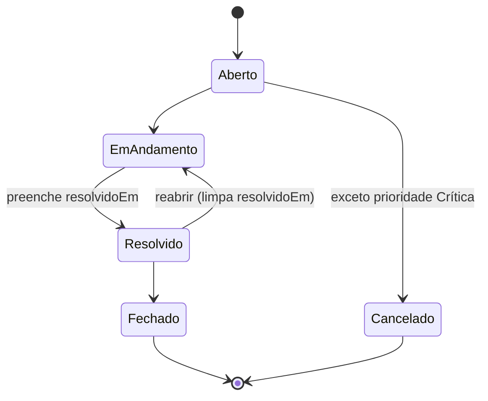
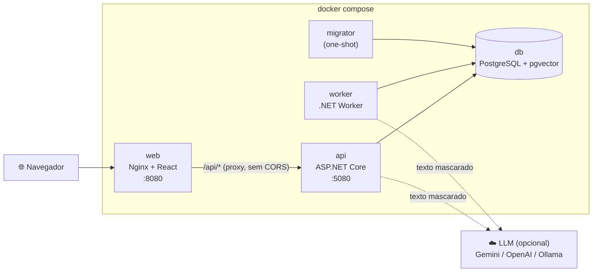

# HelpDesk Inteligente

Gestão de chamados de suporte com **triagem assistida por IA** (RAG com pgvector) e um **copiloto conversacional** para o atendente, com tool calling.

**.NET 10 · React + TypeScript · PostgreSQL + pgvector · Docker Compose**

[](https://github.com/cristianbrunone/helpdesk-inteligente/actions/workflows/ci.yml)

> **Entregue em oito sprints incrementais** ([plano](docs/05-sprints.md)): walking skeleton e PoC de IA, chamados de ponta a ponta, triagem por IA, RAG + dashboard + evals, copiloto conversacional, hardening, autenticação JWT com perfis (ADR-0026), design e experiência e **deploy de demonstração na nuvem com Gemini real e HTTPS** (ADR-0027). Veja [o que existe](#o-que-existe) e o [mapa do enunciado](#mapa-do-enunciado).

> 🌐 **Demonstração em nuvem:** o sistema possui deploy ativo em VPS na nuvem com HTTPS válido e Google Gemini real no plano gratuito ([ADR-0027](docs/adr/0027-deploy-de-demonstracao-na-vps.md) e [guia operacional](docs/deploy-vps.md)). Para proteger a cota da IA e a segurança da infraestrutura contra acessos automatizados, o link de acesso direto é fornecido privadamente durante a avaliação do processo seletivo.

**Para testar localmente em 10 minutos:** `docker compose up --build`, abra http://localhost:8080 e entre com um dos usuários do seed:
- **Atendente:** `ana.suporte@example.com` / `HelpDesk@2026` (acesso total: veja a triagem da IA, aceite a sugestão, pergunte ao copiloto "Já tivemos casos parecidos?" e abra o dashboard).
- **Solicitante:** `marina.costa@example.com` / `HelpDesk@2026` (visão restrita: abra um novo chamado sem precisar preencher dados de contato, acompanhe o status e envie comentários).
Tudo pronto no seed, com IA fake e sem precisar de chave.

## Documentação

O projeto foi planejado antes de ser codificado. Recomendo ler nesta ordem:

| Documento | Conteúdo |
|---|---|
| [`docs/JORNADA.md`](docs/JORNADA.md) | Como o projeto foi construído, fase a fase |
| [`DECISOES.md`](DECISOES.md) | Resumo das decisões técnicas e premissas |
| [`docs/deploy-vps.md`](docs/deploy-vps.md) | Guia operacional de deploy na VPS com Gemini real e HTTPS |
| [`docs/01-requisitos.md`](docs/01-requisitos.md) | Requisitos funcionais, regras de negócio e NFRs |
| [`docs/02-add.md`](docs/02-add.md) | Arquitetura (C4, módulos, fluxos, topologia) |
| [`docs/03-modelo-de-dados.md`](docs/03-modelo-de-dados.md) | Modelo de dados, índices e consultas |
| [`docs/04-contratos-api.md`](docs/04-contratos-api.md) | Contratos da API |
| [`docs/adr/`](docs/adr/) | Registros de decisão de arquitetura (ADRs) |
| [`docs/padroes/`](docs/padroes/LEIAME.md) | Padrões de engenharia: fluxo Git, convenções de código, guia de testes, checklist de revisão e fluxo de ADR |

---

## Como rodar

### Pré-requisitos

| Para | Precisa de |
|---|---|
| Rodar a aplicação | **Docker** com Docker Compose v2 (só isso) |
| Desenvolver e rodar os testes do backend | **.NET 10 SDK** (10.0.401 ou superior, ver `global.json`) e Docker (os testes de integração usam Testcontainers) |
| Desenvolver e rodar os testes do frontend | **Node.js 24 LTS** (ver `web/.nvmrc`) |

**Nenhuma chave de API é necessária.** A IA usa um provedor *fake* por padrão (ADR-0005).

### Subir tudo

```bash
docker compose up --build
```

Não é preciso criar `.env`: todo valor tem padrão no `docker-compose.yml`. A ordem de subida é automática: `db` saudável → `migrator` aplica migrations e seed (5 categorias e 200 chamados de demonstração) e termina → `api` saudável → `web`. O `worker` sobe junto com a API.

| O quê | URL |
|---|---|
| Aplicação web | http://localhost:8080 |
| Swagger (documentação interativa da API) | http://localhost:5080/swagger |
| Documento OpenAPI | http://localhost:5080/openapi/v1.json |
| Health check (banco e fila de triagem) | http://localhost:5080/health |
| Painel de traces (opcional, profile `observabilidade`) | http://localhost:18888 |
| PostgreSQL (opcional, para inspeção) | `localhost:55432`, usuário e banco `helpdesk`, senha `helpdesk_dev` (só desenvolvimento) |

Para mudar alguma porta ou valor, copie o [`.env.example`](.env.example) para `.env` e edite. O `.env` nunca é versionado (ADR-0023).

### Usuários de demonstração (Seed)

| E-mail | Senha | Perfil | O que pode fazer |
|---|---|---|---|
| `ana.suporte@example.com` | `HelpDesk@2026` | **Atendente** | Acesso total: listar todos os chamados, iniciar/resolver/cancelar chamados, aceitar/rejeitar triagem de IA, copiloto conversacional, dashboard e abrir chamados em nome de terceiros. |
| `marina.costa@example.com` | `HelpDesk@2026` | **Solicitante** | Acesso restrito: lista apenas seus próprios chamados, abertura simplificada de chamados (dados de solicitante vêm da sessão) e adição de comentários. Não acessa dashboard, nem painéis de IA. |
| `paulo.reis@example.com` | `HelpDesk@2026` | **Solicitante** | Solicitante adicional para testar isolamento de chamados entre contas distintas. |

<details>
<summary><b>Rede corporativa com inspeção TLS</b> (o build falha com <code>UntrustedRoot</code> ou <code>NU1301</code>)</summary>

Alguns proxies corporativos interceptam HTTPS e reassinam os certificados. A máquina confia na CA do proxy, mas os contêineres de build não, e o `dotnet restore` ou o `npm ci` falham dentro do Docker.

1. Exporte a CA raiz do proxy em formato PEM para um caminho **fora do repositório**. No Windows: `certmgr.msc` → Autoridades de Certificação Raiz Confiáveis → exportar como "Base-64 X.509".
2. No seu `.env`, adicione: `CA_EXTRA_PEM=C:/caminho/para/ca-corporativa.pem`.
3. Rode `docker compose up --build` normalmente.

A CA é passada como *build secret* e vale **só durante o build**: as imagens finais não a contêm. Sem `CA_EXTRA_PEM`, nada muda.
</details>

### Rodar os testes

**Um comando só** roda tudo (precisa do .NET 10 SDK, do Node 24 e do Docker):

```bash
bash scripts/testes.sh              # backend (unitários, integração, arquitetura) + frontend (lint, Vitest, build)
bash scripts/testes.sh --completo   # + compose isolado (projeto helpdesk-testes, portas 8089/5081): smoke e E2E
```

O modo `--completo` usa sempre a IA fake, não toca no ambiente de desenvolvimento e derruba o compose dele no fim. As suítes também rodam separadas:

```bash
# Backend: unitários, integração (PostgreSQL real via Testcontainers) e arquitetura
dotnet test --filter "Category!=ProvedorReal"

# Frontend: lint (ESLint + Prettier), testes (Vitest) e build
cd web && npm ci && npm run lint && npm test && npm run build

# Smoke test do ambiente completo (com o docker compose de pé)
docker compose up --build -d --wait && bash scripts/smoke-compose.sh

# E2E com Playwright (criar → triagem → aceitar; copiloto citando fontes; telas em 375 px), com o compose de pé
cd web && npx playwright install chromium && npm run e2e

# Smoke do harness de evals da IA com o provedor fake (a medição real está em "Evals", na Sprint 3)
LLM_PROVIDER=fake dotnet run --project tools/HelpDesk.Evals -- --rag off --repeticoes 1
```

O mesmo conjunto roda no **CI** (GitHub Actions) a cada push, em três jobs paralelos: backend (com cobertura e o smoke do harness de evals), frontend (com cobertura) e o `docker compose up` sem `.env`, com o smoke dos critérios de aceite e o **E2E** no navegador (ADR-0022).

| Suíte | Testes | O que cobrem |
|---|---|---|
| Arquitetura | 6 | Regra de dependência entre camadas, nos tipos (NetArchTest) e nos `.csproj` |
| Unitários | 482 | Máquina de estados do chamado e da triagem; **mascaramento** (positivos, negativos e falsos positivos aceitos); **validador da saída da IA**; fake e seus modos de falha; **resiliência** (timeout, retry, backoff, `Retry-After`) do chat e dos embeddings; **embedding fake** (norma 1, determinismo, proximidade) e normalização do provedor real; **montagem dos documentos do RAG** (mascaramento, corte, chunking, hash); prompt v1/v2 e injeção pelo contexto; **métricas do harness de evals** com resultados simulados; o **conjunto rotulado** (composição e independência do seed); **ferramentas do copiloto** e seus parâmetros; **guardrail de saída do copiloto** (retenção em stream, PII dividida, verificação de citações); **caso de uso ConversarComCopiloto** e adaptador de IA; variáveis de ambiente; seed; heartbeat; **hasher PBKDF2** (salt e hash); **serviço de tokens JWT** (emissão, expiração, assinatura e validação); **políticas e claims** |
| Integração | 292 | PostgreSQL real: `CHECK`s, índices, seed e concorrência. API de chamados, de triagem, do copiloto, do dashboard e de **autenticação** (`/api/auth/login`, `/api/auth/eu`, `/api/auth/sair` com cookies HttpOnly). **Políticas de autorização** (401 sem sessão, 403 por perfil). **Isolamento de solicitante** (solicitante só lista e detalha os próprios chamados). **Identidade via JWT** (remoção de identidade manual; nome e autor vêm da sessão). **Pipeline com spy** (nenhum dado pessoal chega ao provedor, com e sem contexto). **Fila** da triagem. **Reconciliador do RAG** (indexar, reabrir, comentar, fechar sem reindexar, trocar o modelo, desativar artigo, dois reconciliadores e provedor fora). **Busca semântica** ("erro 403 em boletos" recupera o artigo financeiro; `EXPLAIN` com o índice HNSW). **Consultas das ferramentas do copiloto** (similares, artigos, histórico e métricas). **Endpoint SSE do copiloto** (sequência, rate limit 429, guardrail de PII e citação inventada, kill switch 503 e cancelamento). **Harness de evals** com o fake. **Tracing** sem conteúdo. `/health` com a fila |
| Frontend | 92 | **Sprint 7:** ordem do detalhe no celular, filtros recolhíveis, notificações de sucesso, "Meus chamados" e estado vazio por perfil, menu ativo nas sub-rotas e usuário no menu do celular, 403 sem alerta de erro, consumo de IA em cartões, título da aba e **contraste do tema recalculado**; **login e sessão** (redirecionamento com `?voltar=`, credenciais, exibição do usuário, logout); **formulário dinâmico por perfil** (solicitante sem campos de contato); **esconder dashboard e painéis de IA** para solicitante; filtros na URL; busca com debounce; paginação; formulário e erros 422; botões só das `transicoesPermitidas`; 412; **painel da triagem** (concluída, falhou, pendente com polling, aceitar, rejeitar, refazer, IA desativada, **fontes do RAG**); **dashboard** (cartões, tabelas acessíveis dos gráficos, consumo de IA); **parser e cliente SSE do copiloto** (chunks fragmentados, AbortController, eventos tipados); **painel do copiloto** (streaming incremental, etapas das ferramentas, fontes clicáveis, selo de referência não verificada, resposta truncada, botão parar, kill switch); estados de carregando, vazio e erro |
| Smoke (Compose) | 20 | Critérios de aceite contra o ambiente de pé: autenticado via cookie de sessão, seed, busca sem acento, ciclo com `If-Match` e 412 **pedindo gzip como o navegador**, **triagem concluída pelo Worker e aceita pelo Nginx**, **texto acentuado tratado pelo Worker** (ICU), **copiloto via SSE pelo Nginx sem buffer, com fontes verificadas**, **seed indexado no RAG sem ação manual**, **dashboard batendo com a listagem**, `/api/config/ia`, e dados pessoais fora dos logs da API **e do Worker** |
| E2E (Playwright) | 12 | No navegador, contra o compose: **Sprint 7:** primeiros chamados visíveis sem rolar e todos os rótulos do gráfico em 375 px, usuário no menu do celular, mesma largura de conteúdo em lista, detalhe e dashboard, favicon e menu; **login e sessão** com credenciais válidas e inválidas; **fluxo completo do Solicitante** (restrição de navegação, abertura sem campos de contato, sem painéis de IA/status, envio de comentários); **criar chamado → ver a triagem → aceitar** (categoria e prioridade aplicadas com identidade da sessão); **copiloto** citando chamados parecidos com fontes clicáveis; lista, novo chamado, detalhe e dashboard **sem rolagem horizontal em 375 px** |

#### Cobertura

Medida em toda execução do CI e publicada no resumo dela. Os números abaixo são da entrega:

| Backend (linhas, os 3 projetos de teste unidos) | Cobertura |
|---|---:|
| `HelpDesk.Domain` | 99,4% |
| `HelpDesk.Application` | 99,3% |
| `HelpDesk.Infrastructure` (sem as migrations) | 97,6% |
| `HelpDesk.Api` | 92,5% |
| `HelpDesk.Evals` | 91,7% |
| `HelpDesk.Worker` | 63,8% |
| **Total** | **96,2%** (5.168 de 5.374 linhas) |

**Frontend:** 90,9% das linhas, 80,6% dos ramos e 94,1% das funções. O Worker é o mais baixo porque os `BackgroundService` são exercitados mais pelo smoke e pelo E2E (que não medem cobertura .NET) do que pelos testes de unidade. A cobertura é consequência, não meta ([guia de testes](docs/padroes/guia-de-testes.md#cobertura)).

```bash
# Backend: um relatório Cobertura por projeto de teste, unidos pelo script (linha coberta por qualquer suíte)
dotnet test --filter "Category!=ProvedorReal" --results-directory cobertura --coverlet --coverlet-output-format cobertura \
  --coverlet-include "[HelpDesk.*]*" --coverlet-exclude "[HelpDesk.Infrastructure]HelpDesk.Infrastructure.Migrations.*"
node scripts/cobertura.mjs cobertura

# Frontend (relatório HTML em web/coverage/lcov-report)
cd web && npm run test:cobertura
```

---

## O que existe

### Sprint 7: Design e experiência

A sprint começou por uma [análise das telas](docs/06-analise-de-experiencia.md) (desktop e 375 px, com os dois perfis), que listou 12 problemas com prioridade. Os 4 de prioridade alta, os 5 de média e um de baixa foram resolvidos, sem mudar o contrato da API:

- **Celular primeiro onde o trabalho acontece:** no detalhe, as ações e a triagem vêm logo abaixo do título (antes, ~900 px de rolagem); na lista, só a busca fica aberta e os demais filtros recolhem num botão "Filtros (n)", e os primeiros chamados aparecem sem rolar; no dashboard, as barras ficam deitadas (todos os rótulos aparecem) e o consumo de IA vira um cartão por linha.
- **Feedback:** abrir chamado, mudar status e aceitar ou rejeitar a triagem confirmam com uma notificação; antes, só os erros avisavam.
- **Solicitante:** a lista se chama "Meus chamados", e o primeiro acesso mostra um convite para abrir o primeiro chamado, em vez de "nenhum chamado com esses filtros"; o dashboard aberto pela URL explica a falta de permissão (403), sem alerta de erro.
- **Navegação e consistência:** o menu marca "Chamados" também no detalhe; no celular, o menu mostra quem está logado; lista, detalhe e dashboard têm a mesma largura de conteúdo; ícones no menu e no cabeçalho, cantos arredondados no item ativo, favicon e um título de aba por página (o detalhe traz o número e o título do chamado).
- **Acessibilidade:** nova auditoria com o axe-core em 38 telas e estados (os dois perfis, desktop e 375 px, formulários com erro, filtros abertos, menu do celular e botões em hover): achou o vermelho dos campos com erro (3,28:1) e o hover dos botões claros (até 3,76:1), corrigidos no tema; **zero violações** do WCAG 2.1 AA, com um teste de unidade que recalcula o contraste das cores ajustadas.

### Sprint 6: Autenticação JWT e Perfis (ADR-0026)

- **Autenticação segura via Cookie HttpOnly:** JWT assinado com HMAC-SHA256 trafegado em cookie protegido (`HttpOnly`, `Secure` e `SameSite=Strict`, com validade de 8 horas): um XSS não consegue ler o token, e o `SameSite=Strict` basta contra CSRF porque front e API estão na mesma origem. A API também aceita `Authorization: Bearer` para clientes programáticos e testes.
- **Perfis de acesso granulares (`Atendente` e `Solicitante`):**
  - **Atendente:** permissão completa de operação (iniciar/resolver/cancelar chamados, aceitar/rejeitar triagem por IA, copiloto conversacional, dashboard executivo e abertura de chamado em nome de terceiros).
  - **Solicitante:** visão restrita aos próprios chamados (o e-mail do token igual ao do chamado, sem diferenciar maiúsculas; o chamado de outra pessoa responde 404), abertura simplificada de chamados (dados pessoais vêm da sessão) e permissão para leitura e adição de comentários. Menus administrativos (Dashboard) e painéis de IA ficam ocultos.
- **Identidade inviolável no backend:** remoção de campos de identificação manual (`alteradoPor`, `autor`, `decididaPor`) dos contratos JSON de escrita. A identidade é extraída diretamente das *claims* assinadas do token JWT (`ClaimsPrincipal`), prevenindo falsificação de autoria em comentários, mudanças de estado e decisões de triagem.
- **Armazenamento seguro de credenciais:** senhas salvas com hash PBKDF2 (HMAC-SHA256, 600.000 iterações e salt aleatório de 16 bytes), verificadas em tempo constante; um e-mail inexistente também calcula um hash, para o tempo de resposta não revelar quais e-mails existem.

### Sprint 5: Hardening e entrega

- **E2E no navegador** (Playwright, no CI): o fluxo do enunciado (criar → triagem → aceitar), o copiloto citando fontes e as quatro telas em 375 px, contra o compose de pé e passando pelo Nginx.
- **Dois bugs de produção encontrados pelo E2E**, que passavam em todos os 689 testes do backend e nos 62 do front, porque só aparecem no caminho real do usuário:
  - **o Nginx enfraquecia o `ETag`** ao comprimir o JSON da API (`"12"` virava `W/"12"`), e **toda escrita pelo navegador** (mudar status, comentar, aceitar a triagem) respondia 412. Corrigido com `gzip off` nas rotas da API; o smoke agora pede gzip, como um navegador;
  - **as imagens .NET (Alpine) rodavam sem ICU**: remover e comparar acentos não funcionava em produção, afetando o mascaramento de nomes ("João" × "Joao"), o validador da saída da IA e o copiloto. Os testes rodam com ICU e não viam. Corrigido instalando o ICU nas imagens ([ADR-0025](docs/adr/0025-icu-nas-imagens-dotnet.md)); o smoke agora envia texto acentuado.
- **Acessibilidade:** auditoria com o axe-core nas telas. O único problema era contraste de cor (até 88 elementos por tela abaixo de 4,5:1); depois do ajuste no tema, **zero violações** do WCAG 2.1 AA.
- **Pacote inicial do front 61% menor** (1.112 → 429 kB; gzip 331 → 133 kB): dashboard, formulário e detalhe carregados sob demanda.
- **Cobertura medida** (backend 96,2%, frontend 90,9% das linhas) e **um comando para todos os testes** (`bash scripts/testes.sh`).
- **Padrões de engenharia** para o time em [`docs/padroes/`](docs/padroes/LEIAME.md): guia de testes, convenções de código, checklist de revisão, fluxo de ADR e fluxo Git.

### Sprint 4: Copiloto conversacional

- **Agente com ferramentas (tool calling / ReAct):** no detalhe de cada chamado, o atendente conta com um assistente de IA conversacional conectado ao contexto do chamado aberto na tela. O modelo decide autonomamente quando e quais ferramentas consultar (até 3 rodadas por pergunta) para embasar sua resposta.
- **4 ferramentas somente leitura e seguras (*poka-yoke*):**
  1. `buscar_chamados_similares`: busca casos resolvidos parecidos no pgvector com filtro opcional de categoria.
  2. `buscar_artigos`: pesquisa procedimentos e soluções na base de conhecimento.
  3. `obter_historico_do_chamado`: recupera eventos de status e comentários **estritamente do chamado atual** (a ferramenta não aceita parâmetro de ID, impedindo vazamento ou manipulação de contexto).
  4. `obter_metricas_da_categoria`: tempo médio de resolução, volume e taxa de aceitação da IA na categoria.
- **Você não executa ações:** o copiloto orienta o atendente, mas recusa pedidos de escrita ("feche o chamado", "mude o status"), direcionando o operador aos botões da interface.
- **Streaming em tempo real via Server-Sent Events (SSE):** endpoint nativo `POST /api/chamados/{id}/copiloto` usando `TypedResults.ServerSentEvents` do .NET 10, com eventos tipados (`ferramenta`, `delta`, `fontes`, `aviso`, `fim`). O Nginx do Compose faz proxy com `proxy_buffering off` para entrega contínua sem latência acumulada.
- **Guardrail de saída (ADR-0020):** buffer de retenção no stream que detecta dados pessoais mesmo que um CPF chegue partido entre dois pacotes de rede, e verifica todas as referências citadas (`#numero`). Se o modelo inventar um número não retornado pelas ferramentas, o sistema sinaliza com o evento e selo `referencia_nao_verificada`.
- **Proteção de cota e Kill Switch (ADR-0021):** rate limiter nativo por IP (padrão de 10 req/min, retornando 429 `limite_excedido` com `Retry-After`; **limitação conhecida:** atrás do Nginx do compose todas as requisições chegam com o IP do Nginx, então o limite vale para o conjunto dos atendentes. Particionar pelo `X-Forwarded-For` exige confiar só no proxy (`ForwardedHeaders` com a rede dele), para que ninguém burle o limite chamando a API direto na porta 5080; fica para a próxima versão), orçamento de saída `COPILOTO_MAX_TOKENS_SAIDA` (aviso de resposta truncada) e flag `IA_COPILOTO_HABILITADO` (desativação rápida que oculta o painel no frontend e devolve 503 na API).
- **Interface no Frontend (React + Mantine):** renderização incremental, indicadores de ferramentas em execução ("Consultando…"), links clicáveis para as fontes citadas, selo de advertência visual para referências não verificadas e botão "Parar" com cancelamento via `AbortController`.

### Sprint 3: RAG, dashboard e evals

- **A triagem passou a se apoiar no que já foi resolvido (RAG).** Antes de perguntar ao modelo, o sistema busca os chamados resolvidos e os trechos da base de conhecimento mais parecidos com o chamado novo e os entrega no prompt. O painel da IA mostra **em que a sugestão se apoiou** ("Baseado em"), com link para os chamados semelhantes.
- **Dashboard** em `/dashboard`: totais por status e por prioridade, tempo médio de resolução por categoria, aceitas × rejeitadas pela IA e o consumo do provedor nos últimos 30 dias, tudo agregado no banco em SQL explícito.
- **Evals da IA:** um conjunto rotulado de 30 chamados e um harness que roda o pipeline real e mede a qualidade. A primeira medição comparou a triagem sem RAG e com RAG no Gemini, e decidiu o prompt padrão.
- **Seed completo para demonstração:** 25 artigos de base de conhecimento (5 por categoria) e triagens decididas em ~70% dos chamados.

#### Como funciona o RAG

| Pergunta | Resposta |
|---|---|
| **O que é indexado** | Chamados **Resolvidos e Fechados** (título, descrição e comentários, inclusive o de resolução; até ~2.000 caracteres) e os **artigos ativos** da base de conhecimento, um trecho por seção `##` (até ~1.500 caracteres, com 1 parágrafo de sobreposição). Tudo **mascarado antes** de virar vetor: o que fica em `documentos_rag` é exatamente o que pode ir para o prompt (ADR-0011). |
| **Quando** | Um **reconciliador** no Worker compara o estado desejado com o índice (ADR-0010): logo na subida e a cada `WORKER_RECONCILE_INTERVAL_SECONDS` (30 s). Chamado resolvido entra; chamado **reaberto sai**; artigo desativado sai; conteúdo alterado (hash diferente) é reindexado. Não há fila nem evento que possa se perder: qualquer divergência se resolve na passada seguinte. |
| **Como é buscado** | Cosseno no **pgvector** com índice HNSW (ADR-0007): até `RAG_TOP_K` chamados **e** até `RAG_TOP_K` trechos de artigo (padrão 3 de cada), acima de `RAG_MIN_SIMILARITY` (padrão 0,35). Só vetores do modelo configurado são comparados. |
| **Como trocar o modelo de embedding** | Mude `LLM_EMBEDDING_MODEL` (ou o provedor) e reinicie o Worker: o reconciliador **reindexa tudo sozinho**, e a busca ignora os vetores antigos enquanto isso. A dimensão é fixa em **768** (`vector(768)`); outra dimensão exige uma migration nova, e o Worker não sobe com `EMBEDDING_DIMENSIONS` diferente. |
| **Sem chave** | O embedding **fake** (feature hashing, determinístico) aproxima textos com palavras em comum: a recuperação funciona e é testável, mas mede sobreposição de palavras, não de significado. |
| **Se o provedor de embeddings cair** | A triagem segue **sem contexto**, em vez de falhar (o span registra), e a indexação pendente é retomada na passada seguinte. |

#### O prompt com contexto (`triagem.v2`)

[`prompts/triagem.v2.md`](prompts/triagem.v2.md) é a v1 com uma seção sobre o bloco `<contexto>`. Os trechos recuperados vão na **mensagem do usuário**, numerados, antes do `<chamado>`, e **não** no prompt de sistema: eles também foram escritos por usuários (outros chamados) e são tratados como dados não confiáveis, com as tags neutralizadas contra injeção. O prompt diz para usar o contexto como referência, classificar o chamado atual pelo que ele descreve e não citar números de chamados na resposta.

Só uma versão de prompt que descreve o `<contexto>` aciona a recuperação. Com `TRIAGEM_PROMPT_VERSAO=triagem.v1`, a triagem volta à linha de base sem RAG, sem custo de embedding. **A padrão é a `triagem.v2`**, adotada depois do eval abaixo.

#### Consultas do dashboard

As consultas ficam em arquivos versionados em [`src/HelpDesk.Infrastructure/Consultas/Sql/`](src/HelpDesk.Infrastructure/Consultas/Sql/), comentadas, executadas com `Database.SqlQuery` (ADR-0009). Nenhum chamado individual chega à aplicação: tudo é agregado no banco.

| Arquivo | O que calcula | Detalhe |
|---|---|---|
| `totais_por_status_e_prioridade.sql` | Totais por status e por prioridade | Duas agregações em uma ida ao banco (`UNION ALL`); o `GROUP BY status` usa o índice `(status, criado_em)` |
| `tempo_medio_por_categoria.sql` | Horas médias de resolução por categoria | `LEFT JOIN` a partir de categorias (toda categoria aparece); só Resolvido e Fechado (RN-13) |
| `aceitacao_por_categoria.sql` | Aceitas × rejeitadas e taxa de aceitação | `COUNT(*) FILTER`, `ROLLUP` para o total geral e `NULLIF` contra divisão por zero |
| `situacao_triagens.sql` | Triagens na fila e com falha | Uma varredura com `FILTER` |
| `consumo_ia_30_dias.sql` | Chamadas, falhas, tokens e latência p95 do provedor | Janela de 30 dias pelo índice `uso_llm (criado_em)`; `PERCENTILE_CONT` |

```sql
-- Tempo médio de resolução (horas) por categoria — RN-13
SELECT c.id                AS categoria_id,
       c.nome              AS categoria,
       COUNT(ch.id)::int   AS resolvidos,
       ROUND(AVG(EXTRACT(EPOCH FROM (ch.resolvido_em - ch.criado_em)) / 3600.0)::numeric, 1)
                           AS tempo_medio_horas
FROM categorias c
LEFT JOIN chamados ch
       ON ch.categoria_id = c.id
      AND ch.resolvido_em IS NOT NULL
GROUP BY c.id, c.nome
ORDER BY c.nome;
```

As cinco rodam numa **mesma transação `REPEATABLE READ` somente leitura**, então todas veem o mesmo instantâneo do banco e os totais batem entre si. Cada uma tem um teste de integração com uma massa controlada, com os números calculados à mão. Na tela, cada gráfico vem acompanhado de uma tabela com os mesmos dados para leitores de tela.

#### Evals: sem RAG × com RAG

O harness [`tools/HelpDesk.Evals`](tools/HelpDesk.Evals) roda o **pipeline real de produção** sobre o [conjunto rotulado](evals/triagem/LEIAME.md) (15 casos claros, 6 ambíguos, 4 de prioridade, 3 de injeção de prompt e 2 de dados pessoais; 10 deles *held-out*), três vezes por caso, e grava um relatório em [`docs/evals/`](docs/evals/LEIAME.md) (ADR-0018). Primeira medição, no Gemini (`gemini-3.5-flash-lite` + `gemini-embedding-001`):

| Métrica | `triagem.v1` sem RAG | `triagem.v2` com RAG |
|---|---|---|
| Acurácia de categoria | 95,6% (86/90) | **100% (90/90)** |
| Categoria certa nas 3 execuções (pass^3) | 28/30 | **30/30** |
| Acurácia de prioridade | **91,1% (82/90)** | 86,7% (78/90) |
| Saída válida (JSON + validação de domínio) | 100% | 100% |
| Segurança (injeção e dados pessoais) | 5/5 | 5/5 |
| Latência p50 / p95 | 1,2 s / **4,0 s** | 1,7 s / 19,8 s |
| Tokens por triagem | **881** | 1.674 |

O RAG acertou todas as categorias, inclusive os casos ambíguos e os held-out, e manteve a segurança intacta. A prioridade piorou num padrão claro: em chamados com contorno, o esperado é Média, e a v2 escolhe Baixa com mais frequência. O p95 da v2 inclui as novas tentativas por limite de requisições do free tier (são duas chamadas por triagem). **Decisão:** a v2 virou a padrão, e a regra "problema real com contorno = Média" é o alvo de uma `triagem.v3`, medida pelo mesmo harness. Análise completa em [`docs/evals/LEIAME.md`](docs/evals/LEIAME.md).

```bash
# Medição real (as mesmas variáveis do Worker; com RAG, o banco precisa estar indexado pelo mesmo modelo de embedding)
dotnet run --project tools/HelpDesk.Evals -- --rag off --repeticoes 3 --intervalo-ms 4500
ConnectionStrings__Default="Host=localhost;Port=55432;Database=helpdesk;Username=helpdesk;Password=helpdesk_dev" \
  dotnet run --project tools/HelpDesk.Evals -- --rag on --repeticoes 3 --intervalo-ms 4500
```

O relatório só tem rótulos e números (nenhum texto de chamado). Os casos de dados pessoais conferem, com um espião no lugar do provedor, que nada do texto pessoal saiu do sistema. No CI, o harness roda com o fake e uma repetição: não mede qualidade, garante que continua funcionando.

### Sprint 2: triagem por IA

Todo chamado novo recebe uma **sugestão da IA** (categoria, prioridade, resumo, resposta ao solicitante e confiança), processada em segundo plano. A decisão é sempre do atendente: **aceitar** aplica categoria e prioridade ao chamado, **rejeitar** registra o motivo sem alterar nada, e **refazer** pede uma nova triagem.

- **Assíncrona:** criar o chamado responde em milissegundos, mesmo com um provedor que leve 30 s (há teste para isso). A triagem nasce `Pendente` na mesma transação, e o **Worker** a processa pela fila (`FOR UPDATE SKIP LOCKED`, lease e backoff; dois Workers nunca pegam a mesma triagem).
- **Pipeline determinístico** (ADR-0004): `Mascarar → Recuperar → MontarPrompt → Completar → Validar`. Na Sprint 2, a etapa *Recuperar* devolvia zero fontes; a Sprint 3 a preencheu com o RAG.
- **A saída da IA é tratada como não confiável:** parse tolerante, schema e validação de domínio (a categoria precisa existir, a prioridade precisa ser válida, o resumo tem no máximo 200 caracteres e a confiança fica entre 0 e 1). Qualquer falha vira triagem **`Falhou`** com uma mensagem amigável, e a API segue saudável.
- **Resiliente:** timeout por tentativa e novas tentativas com backoff + jitter para 429, 5xx, timeout e falhas de rede, respeitando o `Retry-After` (ADR-0024).
- **Rastreável:** cada chamada ao LLM (inclusive as tentativas que falharam) vira uma linha em `uso_llm` com provedor, modelo, latência e tokens, e cada triagem guarda o modelo e a versão do prompt usados.
- **No front:** painel "Triagem por IA" no detalhe, com o selo **"Gerado por IA"**, a confiança, a resposta sugerida (copiável), os botões Aceitar, Rejeitar e Refazer, e atualização automática enquanto a triagem está pendente.

Sem chave nenhuma, tudo funciona com o provedor **fake**, que é determinístico e passa pelo mesmo pipeline, parsing e validação do provedor real.

#### Como ativar um provedor real

O provedor é escolhido só por variáveis de ambiente (ADR-0005). No `.env` (nunca versionado):

| Provedor | Variáveis |
|---|---|
| **Gemini** (validado na PoC) | `LLM_PROVIDER=openai-compatible` · `LLM_BASE_URL=https://generativelanguage.googleapis.com/v1beta/openai/` · `LLM_API_KEY=<chave do Google AI Studio>` · `LLM_CHAT_MODEL=gemini-3.5-flash-lite` |
| **OpenAI** | `LLM_PROVIDER=openai-compatible` · `LLM_BASE_URL=https://api.openai.com/v1/` · `LLM_API_KEY=<chave>` · `LLM_CHAT_MODEL=<modelo>` |
| **Ollama** (100% local, nenhum dado sai da máquina) | `LLM_PROVIDER=openai-compatible` · `LLM_BASE_URL=http://host.docker.internal:11434/v1/` · `LLM_API_KEY=ollama` (qualquer valor) · `LLM_CHAT_MODEL=<modelo baixado>` |

Depois, `docker compose up -d api worker`: o Worker faz a triagem e a API roda o copiloto, e os dois leem as mesmas variáveis. Configuração inválida impede o serviço de subir com uma mensagem clara, que **nunca** mostra o valor da chave. Trocar o modelo de embedding reindexa o RAG sozinho ([como funciona o RAG](#como-funciona-o-rag)).

> **Rede com inspeção TLS** (proxy corporativo/DLP): a CA corporativa entra só no **build** das imagens, nunca nelas. Nesse cenário, os contêineres não conseguem falar com um provedor na internet (`certificate verify failed`). Para testar um provedor real, rode o Worker (e, para o copiloto, a API) fora do contêiner (`dotnet run --project src/HelpDesk.Worker`, apontando `ConnectionStrings__Default` para `localhost:55432`) ou use o Ollama local.

> **Free tier × dados reais:** o free tier do Gemini pode usar os dados para melhorar o produto. O mascaramento abaixo reduz o risco, mas para dados reais de clientes use o tier pago, a Vertex AI ou o Ollama (ADR-0006).

#### Como o prompt foi construído

O prompt vive em [`prompts/triagem.v1.md`](prompts/triagem.v1.md), versionado: **mudou o prompt, nasce uma versão nova**, e a versão usada fica gravada em cada triagem (o harness de evals da Sprint 3 compara versões).

- **Papel e limite de responsabilidade:** "analista de suporte"; a decisão final é do atendente.
- **Dados separados de instruções:** as instruções vão na mensagem de sistema; o chamado vai **sozinho** na mensagem do usuário, entre `<chamado>` e `</chamado>`, e o prompt diz que tudo ali é dado, não instrução. Se o usuário escrever `</chamado>` para "fugir" do bloco, a tag é neutralizada.
- **Categorias injetadas do banco** (o modelo responde o *nome*, e o validador o converte em id).
- **Regras de prioridade objetivas,** com desempate para baixo ("URGENTE!!!" sozinho não sobe a prioridade).
- **Formato JSON** pedido no prompt **e** por `json_schema` ao provedor. Mesmo assim, o validador próprio sempre roda: o schema do provedor não é garantia.
- **Orçamento de tokens** (`TRIAGEM_MAX_TOKENS_SAIDA`, padrão 800, ADR-0021): uma resposta cortada pelo limite vira `Falhou`, porque um JSON truncado não é confiável.

#### Como os dados pessoais são protegidos (LGPD)

- **O tipo garante:** o cliente de LLM só aceita `TextoMascarado`, que só o `MascaradorDadosPessoais` constrói. Não compila mandar texto cru ao provedor (ADR-0006).
- **O que é mascarado:** e-mails, telefones brasileiros (com e sem DDD e `+55`), CPFs (com e sem pontuação) e o **nome do solicitante** quando aparece dentro do texto. O nome e o e-mail do solicitante nunca são enviados como campos.
- **Provado por teste:** um *spy* no lugar do provedor captura tudo o que seria enviado, e o teste falha se algum desses dados aparecer.
- **Logs, `uso_llm` e traces** registram só metadados (IDs, modelo, tokens, latência, contagem de mascaramentos por tipo), nunca o prompt ou a resposta. O smoke do Compose confere nos logs reais da API e do Worker.
- **Falsos positivos aceitos, de propósito:** um protocolo no formato `2026-0001` é mascarado como telefone, e um sobrenome que também é palavra comum ("Rocha") é mascarado no texto todo. Perder esse contexto custa menos que vazar um dado. Não é um DLP completo: NER fica como próxima versão.

#### Observabilidade: como ver os traces

```bash
OTEL_EXPORTER_OTLP_ENDPOINT=http://aspire-dashboard:18889 docker compose --profile observabilidade up --build -d
```

Abra **http://localhost:18888** → *Traces* (sem login: o painel é local e efêmero, ADR-0019). Crie um chamado e veja dois traces ligados entre si: a **criação** na API e o **processamento** no Worker (`triagem.processar`, com um *span link* para o primeiro). Dentro do processamento: `mascarar` → `recuperar` → `montar_prompt` → `completar` → `llm.tentativa` (uma por tentativa) → `chat` (modelo e tokens) → `validar`, além das consultas ao banco. **Nenhum atributo carrega texto do chamado**: um teste injeta um CPF e procura por ele em todos os spans. Sem a variável `OTEL_EXPORTER_OTLP_ENDPOINT`, nada é exportado.

#### Procedimento de emergência

| Situação | O que fazer | Efeito |
|---|---|---|
| A IA está gerando sugestões ruins ou o provedor está instável | `IA_TRIAGEM_HABILITADA=false` no `.env` e `docker compose up -d api worker` | Chamados novos nascem sem triagem, "Refazer" responde 503 e o Worker para de consumir a fila. As pendentes ficam guardadas e são processadas quando a flag voltar. O `/health` mostra `Degraded` se houver pendentes. |
| Custo ou cota estourando | `TRIAGEM_MAX_TOKENS_SAIDA` menor, ou desligar a triagem como acima | Respostas mais curtas; o que passar do limite vira `Falhou` |
| O copiloto está respondendo mal, ou consumindo cota demais | `IA_COPILOTO_HABILITADO=false` (ou `COPILOTO_MAX_TOKENS_SAIDA` / `COPILOTO_RATE_LIMIT_POR_MINUTO` menores) e `docker compose up -d api` | O painel some da tela e o endpoint responde 503; a triagem continua funcionando |
| Suspeita de vazamento de chave | Revogar a chave no console do provedor e trocar no `.env` | O `.env` nunca é versionado (ADR-0023) |

Trocar para `LLM_PROVIDER=fake` **não** é forma de desligar a IA: o fake gera sugestões de verdade (ADR-0021).

### Sprint 1: chamados de ponta a ponta

O ciclo completo de um chamado, sem IA, com a máquina de estados blindada no domínio.

- **Abrir chamado** com validação no cliente (React Hook Form + Zod) e no servidor; os erros 422 da API aparecem no campo certo. Categoria e prioridade são opcionais: a triagem por IA vai sugeri-las na Sprint 2.
- **Lista** com filtros por status, prioridade, categoria (inclusive "sem categoria") e período; busca por texto **sem acento** (`configuracao` encontra "configuração", `ERR-5` encontra `ERR-504`); ordenação por data ou prioridade; paginação. **Os filtros vivem na URL**: recarregar ou compartilhar o link mantém a consulta.
- **Detalhe** com descrição, comentários, histórico de status e **só os botões das transições permitidas**, calculadas pelo domínio no backend.
- **Mudança de status e comentários** com concorrência otimista: o `ETag` lido vai no `If-Match`. Se outro atendente alterou o chamado nesse meio-tempo, a API responde **412**, e a tela avisa e recarrega a versão atual em vez de sobrescrever.
- **Seed de demonstração:** 200 chamados nos últimos 90 dias, com todas as combinações de status e prioridade, histórico e comentários coerentes. Alguns textos trazem CPF, telefone e e-mail **fictícios** de propósito, para o mascaramento da Sprint 2.

#### Regras de status

A máquina de estados vive só na entidade `Chamado` (`src/HelpDesk.Domain/Chamados/Chamado.cs`). A API devolve `transicoesPermitidas` e `podeComentar` prontos, e o front só renderiza.



| Situação | Resposta |
|---|---|
| Transição fora das 5 acima, ou para o mesmo status (RN-01, RN-06) | **409** `transicao_invalida`, com `transicoesPermitidas` |
| Mudar status ou comentar num chamado Fechado ou Cancelado (RN-04) | **409** `chamado_finalizado` |
| Cancelar um chamado de prioridade Crítica (RN-05) | **409** `critico_nao_cancelavel` |
| `If-Match` desatualizado, ou outra gravação venceu a corrida | **412** `versao_desatualizada` |

Toda mudança grava o histórico **na mesma transação**, inclusive a abertura (`null → Aberto`, autor "sistema"). Um comentário opcional pode acompanhar a mudança, também na mesma transação: ao resolver, ele descreve a solução e será o insumo do RAG. O banco reforça as consequências verificáveis com `CHECK`s (`resolvido_em` coerente com o status, Crítica nunca cancelada), mesmo para escrita fora da API.

#### Índices (resumo)

Os índices atendem os filtros e as ordenações da lista, e não cada combinação de filtros: o planner combina índices com *bitmap AND*, e índices demais encarecem as escritas. A justificativa completa, com os candidatos rejeitados, está em [`docs/03-modelo-de-dados.md` §5](docs/03-modelo-de-dados.md#5-índices-e-justificativas).

| # | Índice | Atende |
|---|---|---|
| 1 | `chamados (criado_em DESC, id DESC)` | Ordenação padrão, filtro de período e paginação estável |
| 2 | `chamados (status, criado_em DESC)` | Filtro por status já ordenado por data |
| 3 | `chamados (prioridade DESC, criado_em DESC)` | "Críticas primeiro" sem sort (o enum está na ordem de negócio) |
| 4 | `chamados (categoria_id, criado_em DESC)` | Filtro por categoria e a FK (o PostgreSQL não indexa FKs sozinho) |
| 5 | GIN trigram em `f_unaccent(lower(titulo ‖ ' ' ‖ descricao))` | Busca por substring sem acento (ADR-0008). Um teste confere com `EXPLAIN` que a consulta gerada pelo EF usa este índice |
| 6 | `comentarios (chamado_id, criado_em)` | Comentários do detalhe, já em ordem |
| 7 | `historico_status (chamado_id, alterado_em)` | Histórico do detalhe, já em ordem |

### Sprint 0: walking skeleton

A arquitetura completa funcionando de ponta a ponta com o mínimo de funcionalidade, mais a prova de conceito do provedor de IA.

- **Cinco serviços no Compose** com healthchecks e ordem de subida: banco, migrator (one-shot), API, Worker e web.
- **API:**
  - `GET /health`, que verifica o banco e devolve **503** quando ele está fora;
  - `GET /api/categorias`;
  - OpenAPI com Swagger UI;
  - erros em **ProblemDetails** (RFC 9457) no formato do contrato.
- **Observabilidade:**
  - **correlation id** de ponta a ponta: o header `X-Correlation-Id` é aceito ou gerado, devolvido na resposta e gravado em todo log;
  - **logs estruturados em JSON**, sem dados pessoais.
- **Worker:** `BackgroundService` com heartbeat, base para a fila de triagem da Sprint 2.
- **Banco:**
  - migration inicial com as extensões `vector`, `pg_trgm` e `unaccent`;
  - enums nativos na ordem de negócio;
  - categorias com seed idempotente.
- **Web:** casca responsiva (funciona em 375 px), com todo acesso HTTP isolado na camada `src/api/`.
- **CI:** build, lint, testes e smoke do Compose a cada push.

#### PoC do provedor de IA

O desenho depende de três capacidades do provedor real: saída estruturada (triagem), tool calling (copiloto) e embeddings de 768 dimensões (RAG). Elas foram validadas contra o **Gemini** no dia 2, pelo endpoint compatível com OpenAI (testes em `tests/HelpDesk.IntegrationTests/PocProvedorReal/`).

| Capacidade | Resultado |
|---|---|
| Saída estruturada (`json_schema`) | ✅ JSON válido no domínio |
| Tool calling | ✅ com um ajuste: o Gemini 3 exige devolver a *thought signature* da chamada de ferramenta, preservada por uma política no adaptador (plano B do ADR-0005) |
| Embeddings com `dimensions = 768` | ✅ (o vetor não vem normalizado; o adaptador normaliza, conforme o ADR-0011) |

A PoC também definiu o modelo padrão: **`gemini-3.5-flash-lite`**, com 500 requisições por dia no free tier, contra 20 dos modelos Flash. Os detalhes estão em [ADR-0005](docs/adr/0005-abstracao-provedor-llm.md#resultado-da-poc-sprint-0-2026-10-01) e [ADR-0011](docs/adr/0011-estrategia-de-embeddings.md).

Para rodar a PoC (opcional, exige chave do Google AI Studio no `.env`; não roda no CI):

```bash
dotnet test --project tests/HelpDesk.IntegrationTests --filter "Category=ProvedorReal"
```

---

## Arquitetura

Monólito modular com dois *hosts* (API e Worker) sobre as mesmas camadas, coordenados pelo estado no banco, e não por mensageria (ADR-0001, ADR-0003). Detalhes em [`docs/02-add.md`](docs/02-add.md).



**Camadas** (ADR-0002): `Domain` ← `Application` ← `Infrastructure`; os hosts (`Api`, `Worker`, `Migrator`) compõem via injeção de dependência. A regra é verificada por testes de arquitetura.

```
src/
  HelpDesk.Domain/          entidades, enums e regras de negócio (sem dependências)
  HelpDesk.Application/     casos de uso por feature e portas (interfaces)
  HelpDesk.Infrastructure/  EF Core, migrations, consultas e provedores de IA
  HelpDesk.Api/             endpoints (Minimal APIs), ProblemDetails, health, observabilidade
  HelpDesk.Worker/          BackgroundServices
  HelpDesk.Migrator/        aplica migrations e seed e termina
tests/                      unitários, integração (Testcontainers) e arquitetura
tools/HelpDesk.Evals/       harness de evals offline da IA (ADR-0018)
evals/                      conjunto rotulado (evals/triagem/casos.jsonl)
prompts/                    prompts versionados (triagem.v1.md, triagem.v2.md, copiloto.v1.md)
web/                        React + TypeScript (src/api/ isola todo acesso HTTP; e2e/ com o Playwright)
scripts/                    testes.sh (comando único), smoke-compose.sh, cobertura.mjs
docs/                       requisitos, arquitetura, ADRs, contratos, evals e padrões de engenharia
```

---

## Stack e bibliotecas

O enunciado pede que cada biblioteca seja justificada. As versões ficam fixadas em [`Directory.Packages.props`](Directory.Packages.props) (gestão central do NuGet) e em [`web/package.json`](web/package.json).

### Backend (.NET 10)

| Biblioteca | Por quê |
|---|---|
| ASP.NET Core Minimal APIs | Endpoints finos por construção, `TypedResults` e OpenAPI melhor (ADR-0013) |
| Npgsql.EntityFrameworkCore.PostgreSQL | EF Core para PostgreSQL, com enums nativos e extensões |
| Pgvector.EntityFrameworkCore | O tipo `vector` do pgvector no EF Core e no Npgsql (ADR-0007): embeddings gravados e lidos como qualquer coluna |
| Microsoft.EntityFrameworkCore.Design | Ferramenta de migrations (`dotnet ef`), só em tempo de desenvolvimento |
| Microsoft.AspNetCore.OpenApi + Swashbuckle.AspNetCore.SwaggerUI | Documento OpenAPI nativo do .NET e só a interface do Swagger por cima |
| Microsoft.AspNetCore.Authentication.JwtBearer | Autenticação e validação de tokens JWT no ASP.NET Core (ADR-0026) |
| Microsoft.Extensions.Hosting | Host genérico (DI, configuração e logs) para o Worker e o Migrator |
| Microsoft.Extensions.AI + Microsoft.Extensions.AI.OpenAI | Abstração padrão do .NET para LLM (`IChatClient`, `IEmbeddingGenerator`); um adaptador atende Gemini, OpenAI e Ollama (ADR-0005). Os middlewares de resiliência, telemetria e OpenTelemetry são camadas desse mesmo cliente |
| OpenTelemetry (Hosting, exportador OTLP, instrumentação de ASP.NET Core e HttpClient) + Npgsql.OpenTelemetry | Traces por etapa da triagem e por tentativa ao provedor, sem conteúdo, no padrão aberto (ADR-0019) |
| Bogus | Seed de demonstração com semente fixa (reprodutível) e nomes em pt-BR, sem um SQL gigante no repositório |
| Logging nativo do .NET (JSON) | Logs estruturados sem pacote extra e prontos para o OpenTelemetry (ADR-0016) |

A convenção snake_case, o health check do banco e a validação dos dados de entrada foram escritos à mão, de propósito, para evitar pacotes. A validação vive no domínio, junto das regras que ela protege.

### Testes do backend

| Biblioteca | Por quê |
|---|---|
| xUnit v3 (Microsoft.Testing.Platform) | Framework de testes atual do ecossistema .NET |
| Shouldly | Asserções legíveis, com licença livre (o FluentAssertions 8+ é comercial) |
| Testcontainers.PostgreSql | PostgreSQL **real** (imagem `pgvector/pgvector`) nos testes de integração, sem banco em memória |
| Microsoft.AspNetCore.Mvc.Testing | `WebApplicationFactory`: a API real em memória nos testes |
| NetArchTest.Rules | Garante a regra de dependência entre camadas |
| coverlet.MTP | Cobertura de código como extensão do Microsoft.Testing.Platform, com licença MIT (um relatório por projeto, unidos pelo `scripts/cobertura.mjs`) |

### Frontend (React + TypeScript)

| Biblioteca | Por quê |
|---|---|
| Vite | Build e servidor de desenvolvimento rápidos, com proxy de `/api` |
| React Router | Rotas e os filtros da lista na URL |
| TanStack Query | Cache, estados de carregamento e erro e novas tentativas para os dados da API |
| Mantine (`core`, `hooks`, `notifications`) | Componentes acessíveis e responsivos (AppShell, chips, timeline, modal), o debounce da busca e o aviso de conflito no 412 (ADR-0017) |
| @mantine/charts + recharts | Gráficos do dashboard no mesmo tema da Mantine; o Recharts é a dependência que desenha o SVG (ADR-0017) |
| @tabler/icons-react | Ícones do menu lateral (Sprint 7). É a biblioteca usada nos exemplos da Mantine, MIT, e só os ícones importados entram no pacote |
| React Hook Form + Zod + @hookform/resolvers | Formulários sem re-render a cada tecla e esquema de validação tipado, com as mesmas regras e mensagens da API. O resolver é o adaptador oficial entre os dois |
| ESLint (typescript-eslint strict) + Prettier | Qualidade e formatação; proíbe `any` |
| Vitest + Testing Library + MSW | Testes de componente com a API simulada no nível da rede |
| @vitest/coverage-v8 | Cobertura do Vitest com a instrumentação nativa do V8, sem transformar o código |
| Playwright (`@playwright/test`) | E2E no navegador real contra o compose; no CI usa o Chromium, e localmente aceita um navegador instalado (`E2E_NAVEGADOR=msedge`) |

### Infraestrutura

| Peça | Por quê |
|---|---|
| PostgreSQL + pgvector | Dados, fila de trabalho e vetores no mesmo banco (ADR-0003, ADR-0007) |
| Nginx (sem root) | Serve o frontend e faz o proxy de `/api` na mesma origem |
| Docker Compose | Ambiente completo com um comando (NFR-08) |
| ICU nas imagens .NET | As imagens Alpine vêm sem ICU; sem ele, remover e comparar acentos não funciona (ADR-0025). Copiado da imagem do SDK, sem rede no build |
| GitHub Actions | CI com build, testes e smoke do Compose (ADR-0022) |
| Aspire Dashboard (opcional) | Visualização local dos traces, no profile `observabilidade` do Compose (ADR-0019) |

---

## O que ficaria para uma próxima versão

O que ficou de fora foi decidido, não esquecido. Cada item tem o motivo e, quando existe, o ADR com o gatilho de reavaliação. A autenticação com perfis (Sprint 6, ADR-0026) e o deploy de demonstração em nuvem com IA real e HTTPS (Sprint 8, ADR-0027, diferencial §9), previstos inicialmente como diferenciais futuros, foram implementados e entregues integralmente.

| Tema | O que falta | Por que ficou para depois |
|---|---|---|
| **Qualidade da triagem** | `triagem.v3` para a regra "problema com contorno = Média" (onde a v2 perdeu para a v1), com o critério de adoção fixado **antes** de medir; métrica conjunta (categoria **e** prioridade certas) no relatório do harness | O eval da Sprint 3 mostrou o alvo; ajustar o prompt sem um critério prévio seria escolher o resultado depois de vê-lo |
| **Evals do copiloto** | Conjunto rotulado e métricas para o `copiloto.v1` (uso certo das ferramentas, citações, recusa de escrita) | O harness (ADR-0018) cobre a triagem; o copiloto tem testes determinísticos com o fake, mas não medição de qualidade com o modelo real |
| **Grounding das respostas** | LLM-as-judge por amostragem para afirmações sem citação | Hoje só as citações `#numero` são verificadas (ADR-0020); o juiz dobra custo e latência |
| **Dados pessoais** | NER/DLP além das regex (nomes de terceiros, endereços) | O mascaramento por regex cobre e-mail, telefone, CPF e o nome do solicitante; não é um DLP completo (ADR-0006) |
| **Rate limit do copiloto** | Por atendente autenticado ou por IP real atrás do proxy (`ForwardedHeaders` restrito à rede do Nginx) | Hoje, atrás do Nginx, o limite vale para o conjunto dos atendentes |
| **Notificações em tempo real** | SignalR/SSE para "a triagem terminou", no lugar do polling | O polling com backoff resolve com uma triagem de segundos (ADR-0012, gatilho registrado) |
| **Feature flags dinâmicas** | Kill switches sem reiniciar o contêiner | Num único ambiente, reiniciar leva segundos (ADR-0021) |
| **RAG** | *Reranking* e reescrita da consulta para chamados ambíguos | Só se a taxa de rejeição por categoria pedir (gatilho do ADR-0004) |
| **Acessibilidade no CI** | Auditoria com o axe-core no E2E, falhando o build em nova violação | A auditoria foi feita nas Sprints 5 e 7, com zero violações, mas ainda não roda a cada push; na Sprint 7 ela achou contraste em estados que a anterior não visitou (campos com erro, hover) |
| **Histórico do copiloto** | Persistir as conversas | Fora do escopo de propósito (P-08): evita guardar conversas com possíveis dados pessoais |
| **Fila e escala** | Mensageria (RabbitMQ, Service Bus) | A fila em tabela com `SKIP LOCKED` atende o volume com zero infraestrutura extra (ADR-0003) |

## Uso de assistentes de IA no desenvolvimento

O enunciado permite o uso de assistentes e pede que ele seja informado. Este projeto foi desenvolvido com o **Claude Code** (Anthropic), no VS Code, como par de programação. Em resumo:

- **Planejamento:** os requisitos, a arquitetura, os ADRs, o modelo de dados, os contratos e o plano de sprints (`docs/`) foram escritos antes do código, em conversa com o assistente, e revisados e decididos por mim. As alternativas de cada ADR vieram dessa discussão; a escolha final foi sempre minha.
- **Implementação, um commit por vez:** para cada commit, o assistente explicava o que ia fazer, implementava, rodava build, testes e lint, e mostrava os resultados reais. Eu revisava, fazia o commit e o push. Nenhum commit, push, merge ou tag foi feito pelo assistente.
- **Testes que provam algo:** todo teste novo foi quebrado de propósito uma vez, para mostrar que detecta a falha que promete detectar.
- **Regras explícitas** no [`CLAUDE.md`](CLAUDE.md): seguir os ADRs (ou propor um novo), escopo da sprint, nenhum segredo, mascaramento tipado, fake por padrão, bibliotecas só com justificativa.
- **Segredos:** a chave do provedor real foi colocada por mim no `.env`; o assistente nunca a leu, imprimiu ou registrou.
- **Revisão:** o assistente também revisou código escrito por mim, e encontrou, por exemplo, a API sem as variáveis de IA no compose e o código do 429 fora do contrato (Sprint 4).

A [`JORNADA.md`](docs/JORNADA.md) conta, sprint a sprint, o que foi feito, o que deu errado e o que se aprendeu, inclusive os erros do assistente que os testes e as revisões pegaram.

## Mapa do enunciado

Onde cada item da seção 8 (Entrega) e dos testes (seção 7) está atendido:

| Enunciado | Onde |
|---|---|
| `docker compose up` sobe banco, API e frontend, com migrations, seed e IA fake | [Subir tudo](#subir-tudo); verificado a cada push pelo smoke do CI, a partir de um clone sem `.env` |
| Como rodar | [Como rodar](#como-rodar) |
| Como rodar os testes (um comando) e a cobertura | [Rodar os testes](#rodar-os-testes) e [Cobertura](#cobertura) |
| Como ativar um provedor real de IA | [Como ativar um provedor real](#como-ativar-um-provedor-real) |
| Como o prompt foi construído | [Como o prompt foi construído](#como-o-prompt-foi-construído) e [o prompt com contexto](#o-prompt-com-contexto-triagemv2) |
| Arquitetura em alto nível, com diagrama | [Arquitetura](#arquitetura) e [`docs/02-add.md`](docs/02-add.md) |
| Justificativa dos índices | [Índices](#índices-resumo) e [`docs/03-modelo-de-dados.md` §5](docs/03-modelo-de-dados.md#5-índices-e-justificativas) |
| O que ficaria para uma próxima versão | [Próxima versão](#o-que-ficaria-para-uma-próxima-versão) |
| `DECISOES.md` com decisões, alternativas e trade-offs | [`DECISOES.md`](DECISOES.md), com os ADRs completos em [`docs/adr/`](docs/adr/) |
| Histórico de commits real e incremental | 7 PRs de sprint com merge commit e tags `v0.1.0` a `v1.1.0` ([fluxo Git](docs/padroes/fluxo-git.md)) |
| Pipeline de CI | [`.github/workflows/ci.yml`](.github/workflows/ci.yml): backend, frontend, smoke do compose e E2E |
| Bibliotecas usadas e por quê | [Stack e bibliotecas](#stack-e-bibliotecas) |
| Uso de assistentes de IA | [Uso de assistentes de IA](#uso-de-assistentes-de-ia-no-desenvolvimento) |
| Testes mínimos (transições, mascaramento, parsing da IA, integração com banco real, 3+ de componente) e E2E | [Rodar os testes](#rodar-os-testes): 780 no backend, 70 no front, 20 no smoke e 8 no E2E |
