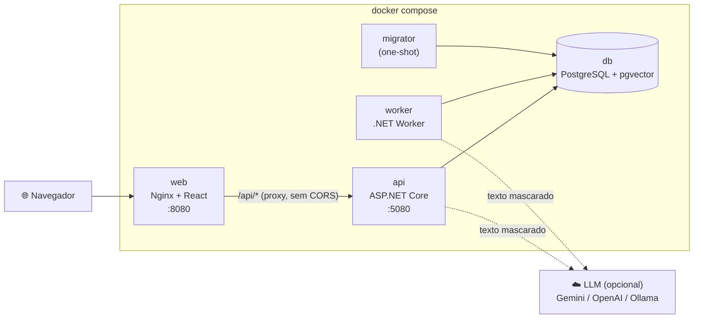

# HelpDesk Inteligente

Gestão de chamados de suporte com **triagem assistida por IA** (RAG com pgvector) e um **copiloto conversacional** para o atendente, com tool calling.

**.NET 10 · React + TypeScript · PostgreSQL + pgvector · Docker Compose**

[](https://github.com/cristianbrunone/helpdesk-inteligente/actions/workflows/ci.yml)

> 🚧 **Em desenvolvimento.** O projeto é construído em sprints incrementais, e este README cresce a cada entrega. O plano está em [`docs/05-sprints.md`](docs/05-sprints.md).
>
> **Entregue até agora:** Sprint 0 (Walking Skeleton + PoC de IA). Veja [o que já existe](#o-que-já-existe-sprint-0).

## Documentação

O projeto foi planejado antes de ser codificado. Recomendo ler nesta ordem:

| Documento | Conteúdo |
|---|---|
| [`docs/JORNADA.md`](docs/JORNADA.md) | Como o projeto foi construído, fase a fase |
| [`DECISOES.md`](DECISOES.md) | Resumo das decisões técnicas e premissas |
| [`docs/01-requisitos.md`](docs/01-requisitos.md) | Requisitos funcionais, regras de negócio e NFRs |
| [`docs/02-add.md`](docs/02-add.md) | Arquitetura (C4, módulos, fluxos, topologia) |
| [`docs/03-modelo-de-dados.md`](docs/03-modelo-de-dados.md) | Modelo de dados, índices e consultas |
| [`docs/04-contratos-api.md`](docs/04-contratos-api.md) | Contratos da API |
| [`docs/adr/`](docs/adr/) | Registros de decisão de arquitetura (ADRs) |

---

## Como rodar

### Pré-requisitos

| Para | Precisa de |
|---|---|
| Rodar a aplicação | **Docker** com Docker Compose v2 (só isso) |
| Desenvolver e rodar os testes do backend | **.NET 10 SDK** (10.0.401 ou superior, ver `global.json`) e Docker (os testes de integração usam Testcontainers) |
| Desenvolver e rodar os testes do frontend | **Node.js 24 LTS** (ver `web/.nvmrc`) |

**Nenhuma chave de API é necessária.** A IA usa um provedor *fake* por padrão (ADR-0005).

### Subir tudo

```bash
docker compose up --build
```

Não é preciso criar `.env`: todo valor tem padrão no `docker-compose.yml`. A ordem de subida é automática: `db` saudável → `migrator` aplica migrations e seed e termina → `api` saudável → `web`. O `worker` sobe junto com a API.

| O quê | URL |
|---|---|
| Aplicação web | http://localhost:8080 |
| Swagger (documentação interativa da API) | http://localhost:5080/swagger |
| Documento OpenAPI | http://localhost:5080/openapi/v1.json |
| Health check | http://localhost:5080/health |
| PostgreSQL (opcional, para inspeção) | `localhost:55432`, usuário e banco `helpdesk`, senha `helpdesk_dev` (só desenvolvimento) |

Para mudar alguma porta ou valor, copie o [`.env.example`](.env.example) para `.env` e edite. O `.env` nunca é versionado (ADR-0023).

<details>
<summary><b>Rede corporativa com inspeção TLS</b> (o build falha com <code>UntrustedRoot</code> ou <code>NU1301</code>)</summary>

Alguns proxies corporativos interceptam HTTPS e reassinam os certificados. A máquina confia na CA do proxy, mas os contêineres de build não, e o `dotnet restore` ou o `npm ci` falham dentro do Docker.

1. Exporte a CA raiz do proxy em formato PEM para um caminho **fora do repositório**. No Windows: `certmgr.msc` → Autoridades de Certificação Raiz Confiáveis → exportar como "Base-64 X.509".
2. No seu `.env`, adicione: `CA_EXTRA_PEM=C:/caminho/para/ca-corporativa.pem`.
3. Rode `docker compose up --build` normalmente.

A CA é passada como *build secret* e vale **só durante o build**: as imagens finais não a contêm. Sem `CA_EXTRA_PEM`, nada muda.
</details>

### Rodar os testes

```bash
# Backend: unitários, integração (PostgreSQL real via Testcontainers) e arquitetura
dotnet test --filter "Category!=ProvedorReal"

# Frontend: lint (ESLint + Prettier), testes (Vitest) e build
cd web && npm ci && npm run lint && npm test && npm run build

# Smoke test do ambiente completo (com o docker compose de pé)
docker compose up --build -d --wait && bash scripts/smoke-compose.sh
```

O mesmo conjunto roda no **CI** (GitHub Actions) a cada push, em três jobs paralelos: backend, frontend e smoke do `docker compose up` sem `.env` (ADR-0022).

| Suíte | Testes | O que cobrem |
|---|---|---|
| Arquitetura | 6 | Regra de dependência entre camadas, nos tipos (NetArchTest) e nos `.csproj` |
| Unitários | 10 | Convenção snake_case do banco e heartbeat do Worker |
| Integração | 19 | Migrations, extensões e enums no PostgreSQL real; idempotência do seed; `/health` (200 e 503); `/api/categorias`; correlation id; ProblemDetails; OpenAPI e Swagger |
| Frontend | 9 | Estados de carregando, vazio e erro do painel de categorias; cliente HTTP (ProblemDetails, falha de rede); casca da aplicação e rota inexistente |

---

## O que já existe (Sprint 0)

A Sprint 0 é o **walking skeleton**: a arquitetura completa funcionando de ponta a ponta com o mínimo de funcionalidade, mais a prova de conceito do provedor de IA.

- **Cinco serviços no Compose** com healthchecks e ordem de subida: banco, migrator (one-shot), API, Worker e web.
- **API:**
  - `GET /health`, que verifica o banco e devolve **503** quando ele está fora;
  - `GET /api/categorias`;
  - OpenAPI com Swagger UI;
  - erros em **ProblemDetails** (RFC 9457) no formato do contrato.
- **Observabilidade:**
  - **correlation id** de ponta a ponta: o header `X-Correlation-Id` é aceito ou gerado, devolvido na resposta e gravado em todo log;
  - **logs estruturados em JSON**, sem dados pessoais.
- **Worker:** `BackgroundService` com heartbeat, base para a fila de triagem da Sprint 2.
- **Banco:**
  - migration inicial com as extensões `vector`, `pg_trgm` e `unaccent`;
  - enums nativos na ordem de negócio;
  - categorias com seed idempotente.
- **Web:** casca responsiva (funciona em 375 px) que carrega as categorias pela camada `src/api/`, com estados de carregando, vazio e erro.
- **CI:** build, lint, testes e smoke do Compose a cada push.

### PoC do provedor de IA

O desenho depende de três capacidades do provedor real: saída estruturada (triagem), tool calling (copiloto) e embeddings de 768 dimensões (RAG). Elas foram validadas contra o **Gemini** no dia 2, pelo endpoint compatível com OpenAI (testes em `tests/HelpDesk.IntegrationTests/PocProvedorReal/`).

| Capacidade | Resultado |
|---|---|
| Saída estruturada (`json_schema`) | ✅ JSON válido no domínio |
| Tool calling | ✅ com um ajuste: o Gemini 3 exige devolver a *thought signature* da chamada de ferramenta, preservada por uma política no adaptador (plano B do ADR-0005) |
| Embeddings com `dimensions = 768` | ✅ (o vetor não vem normalizado; o adaptador normaliza, conforme o ADR-0011) |

A PoC também definiu o modelo padrão: **`gemini-3.5-flash-lite`**, com 500 requisições por dia no free tier, contra 20 dos modelos Flash. Os detalhes estão em [ADR-0005](docs/adr/0005-abstracao-provedor-llm.md#resultado-da-poc-sprint-0-2026-10-01) e [ADR-0011](docs/adr/0011-estrategia-de-embeddings.md).

Para rodar a PoC (opcional, exige chave do Google AI Studio no `.env`; não roda no CI):

```bash
dotnet test --project tests/HelpDesk.IntegrationTests --filter "Category=ProvedorReal"
```

---

## Arquitetura

Monólito modular com dois *hosts* (API e Worker) sobre as mesmas camadas, coordenados pelo estado no banco, e não por mensageria (ADR-0001, ADR-0003). Detalhes em [`docs/02-add.md`](docs/02-add.md).



**Camadas** (ADR-0002): `Domain` ← `Application` ← `Infrastructure`; os hosts (`Api`, `Worker`, `Migrator`) compõem via injeção de dependência. A regra é verificada por testes de arquitetura.

```
src/
  HelpDesk.Domain/          entidades, enums e regras de negócio (sem dependências)
  HelpDesk.Application/     casos de uso por feature e portas (interfaces)
  HelpDesk.Infrastructure/  EF Core, migrations, consultas e provedores de IA
  HelpDesk.Api/             endpoints (Minimal APIs), ProblemDetails, health, observabilidade
  HelpDesk.Worker/          BackgroundServices
  HelpDesk.Migrator/        aplica migrations e seed e termina
tests/                      unitários, integração (Testcontainers) e arquitetura
web/                        React + TypeScript (src/api/ isola todo acesso HTTP)
scripts/                    smoke test do ambiente completo
```

---

## Stack e bibliotecas

O enunciado pede que cada biblioteca seja justificada. As versões ficam fixadas em [`Directory.Packages.props`](Directory.Packages.props) (gestão central do NuGet) e em [`web/package.json`](web/package.json).

### Backend (.NET 10)

| Biblioteca | Por quê |
|---|---|
| ASP.NET Core Minimal APIs | Endpoints finos por construção, `TypedResults` e OpenAPI melhor (ADR-0013) |
| Npgsql.EntityFrameworkCore.PostgreSQL | EF Core para PostgreSQL, com enums nativos e extensões |
| Microsoft.EntityFrameworkCore.Design | Ferramenta de migrations (`dotnet ef`), só em tempo de desenvolvimento |
| Microsoft.AspNetCore.OpenApi + Swashbuckle.AspNetCore.SwaggerUI | Documento OpenAPI nativo do .NET e só a interface do Swagger por cima |
| Microsoft.Extensions.Hosting | Host genérico (DI, configuração e logs) para o Worker e o Migrator |
| Microsoft.Extensions.AI + Microsoft.Extensions.AI.OpenAI | Abstração padrão do .NET para LLM (`IChatClient`, `IEmbeddingGenerator`); um adaptador atende Gemini, OpenAI e Ollama (ADR-0005). Na Sprint 0, só na PoC |
| Logging nativo do .NET (JSON) | Logs estruturados sem pacote extra e prontos para o OpenTelemetry (ADR-0016) |

Convenção snake_case e health check do banco foram escritos à mão, de propósito, para evitar dois pacotes.

### Testes do backend

| Biblioteca | Por quê |
|---|---|
| xUnit v3 (Microsoft.Testing.Platform) | Framework de testes atual do ecossistema .NET |
| Shouldly | Asserções legíveis, com licença livre (o FluentAssertions 8+ é comercial) |
| Testcontainers.PostgreSql | PostgreSQL **real** (imagem `pgvector/pgvector`) nos testes de integração, sem banco em memória |
| Microsoft.AspNetCore.Mvc.Testing | `WebApplicationFactory`: a API real em memória nos testes |
| NetArchTest.Rules | Garante a regra de dependência entre camadas |

### Frontend (React + TypeScript)

| Biblioteca | Por quê |
|---|---|
| Vite | Build e servidor de desenvolvimento rápidos, com proxy de `/api` |
| React Router | Rotas e, a partir da Sprint 1, os filtros da lista na URL |
| TanStack Query | Cache, estados de carregamento e erro e novas tentativas para os dados da API |
| Mantine | Componentes acessíveis e responsivos (AppShell, estados, notificações, gráficos) (ADR-0017) |
| ESLint (typescript-eslint strict) + Prettier | Qualidade e formatação; proíbe `any` |
| Vitest + Testing Library + MSW | Testes de componente com a API simulada no nível da rede |

### Infraestrutura

| Peça | Por quê |
|---|---|
| PostgreSQL + pgvector | Dados, fila de trabalho e vetores no mesmo banco (ADR-0003, ADR-0007) |
| Nginx (sem root) | Serve o frontend e faz o proxy de `/api` na mesma origem |
| Docker Compose | Ambiente completo com um comando (NFR-08) |
| GitHub Actions | CI com build, testes e smoke do Compose (ADR-0022) |
