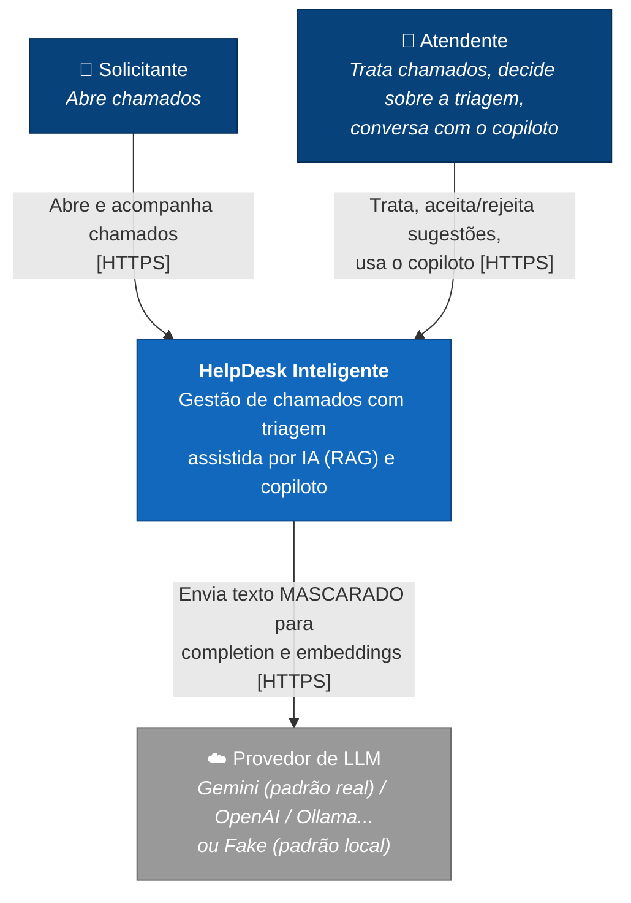
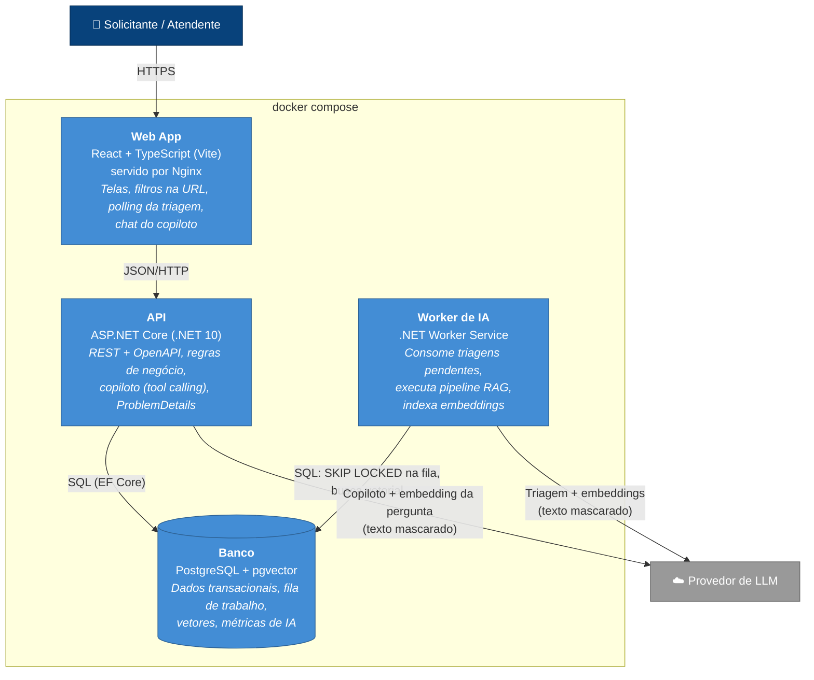
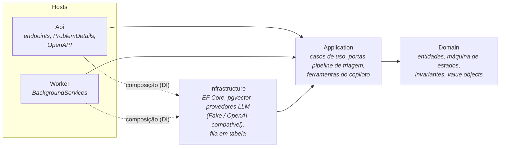
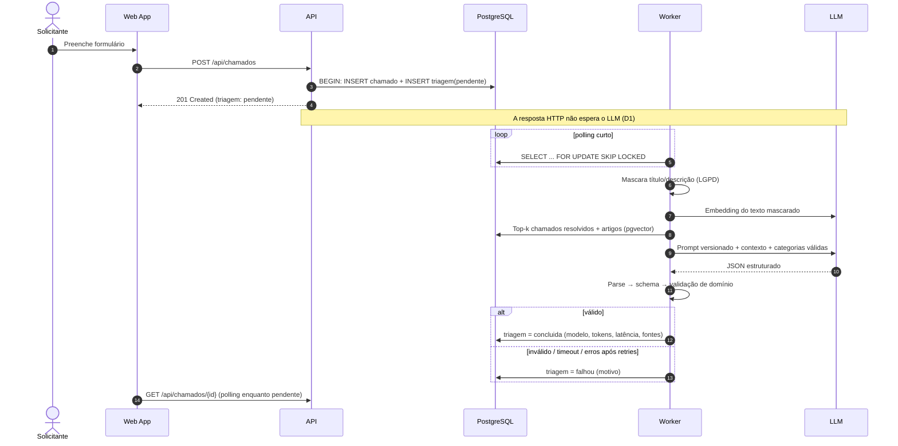
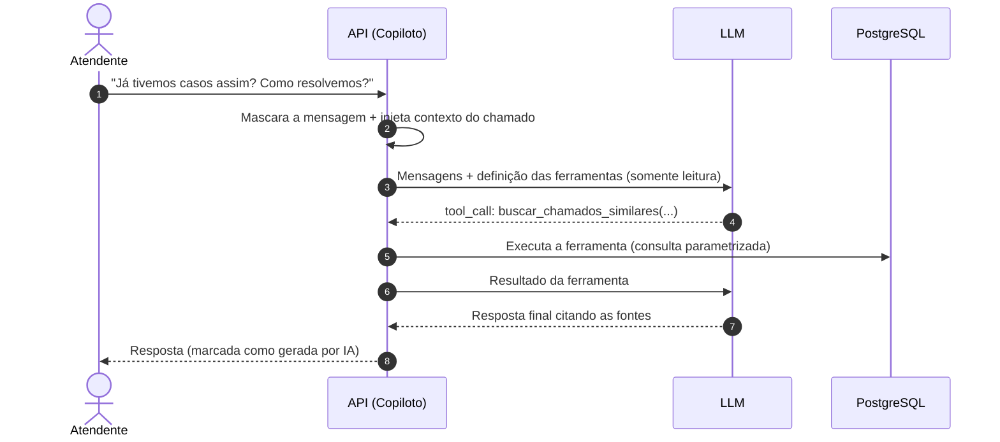
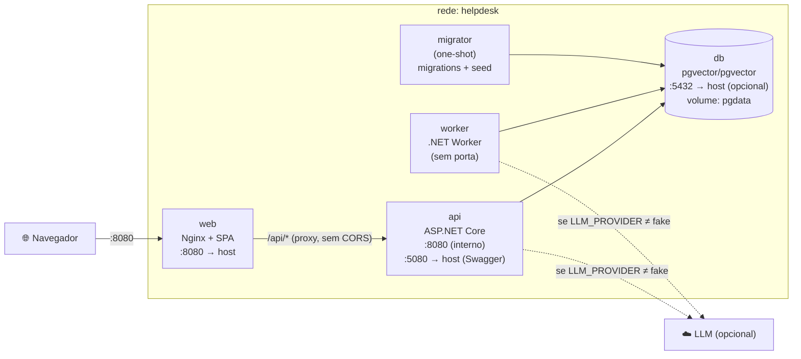

# ADD — Architecture Design Document

> **Fase do checklist:** 2. Estilo arquitetural e 3. Modelagem de dados e comunicação
> **Versão:** 0.2, que acrescenta modelo de dados, contratos de API e topologia (seções 10 a 12) e os ADRs 0007 a 0013.
> **Próxima atualização:** Fase 4 (validação no Walking Skeleton: CI, observabilidade, segurança base).

---

## 1. Contexto

O HelpDesk Inteligente registra chamados de suporte e usa IA para **sugerir** triagem (categoria, prioridade, resumo e resposta inicial). A sugestão é fundamentada em casos semelhantes já resolvidos e numa base de conhecimento (RAG). O atendente conta ainda com um **copiloto conversacional** que consulta os dados do sistema via *tool calling*. A decisão final é sempre humana.

Requisitos completos: [`01-requisitos.md`](01-requisitos.md).

## 2. Direcionadores arquiteturais (ASRs)

Estes são os requisitos que mais influenciam a arquitetura. Os demais são atendidos "naturalmente" por qualquer desenho razoável.

| # | Direcionador | Origem | Impacto no desenho |
|---|---|---|---|
| D1 | Criar chamado **não depende** do LLM | RF-02, NFR-01 | A triagem é assíncrona, fora do ciclo da requisição HTTP. |
| D2 | O LLM é **não confiável** (lento, fora do ar, com saída inválida, com rate limit) | NFR-04, NFR-05 | Timeout, retry, validação em camadas e estados explícitos (`pendente`/`falhou`). |
| D3 | **Nenhum dado pessoal** sai do sistema nem vai para o índice vetorial | RN-10, RN-11, NFR-06 | O mascaramento é um passo obrigatório e único antes de qualquer LLM ou embedding. |
| D4 | O provedor de IA é **trocável** e há um **fake por padrão** | NFR-08, NFR-09, NFR-10 | Abstração de provedor. O fake fica no nível mais baixo, para que parsing e validação rodem sempre. |
| D5 | RAG e tool calling como diferenciais de **IA conversacional** | RF-15..22 | Busca vetorial no mesmo banco, com ferramentas somente leitura. |
| D6 | Subir tudo com **um comando** e ser **avaliável em minutos** | NFR-08 | Pouca infraestrutura: só o necessário no Compose. |
| D7 | Prazo curto (7 dias) com dev solo | Restrição | Simplicidade operacional acima de "escala de papel". |

## 3. Objetivos técnicos

1. **Correção das regras de negócio.** A máquina de estados fica no domínio, é testável isoladamente e é a única fonte de verdade para a API e para o frontend.
2. **IA segura por construção.** Não é possível chamar o LLM sem passar pelo mascaramento, e não é possível persistir uma sugestão sem passar pela validação.
3. **Degradação graciosa.** Qualquer falha de IA vira um estado visível na UI, nunca um erro 500.
4. **Rastreabilidade.** Toda chamada de IA registra modelo, latência, tokens, resultado e as fontes do RAG.
5. **Simplicidade.** Cada peça de infraestrutura precisa justificar sua existência (ver ADR-0001 e ADR-0003).

---

## 4. C4 — Nível 1: Contexto

**Fronteira de confiança:** tudo que atravessa a seta para o provedor de LLM está mascarado. O que volta é tratado como entrada não confiável.

---

## 5. C4 — Nível 2: Contêineres

| Contêiner | Responsabilidade | Por que existe separado |
|---|---|---|
| **Web App** | UI e acesso à API isolado em uma camada de serviço/hooks. | Exigência do enunciado (SPA React). |
| **API** | Casos de uso síncronos e o copiloto (interação em tempo real com o atendente). | Ponto de entrada HTTP. |
| **Worker** | Trabalho lento e falível: triagem e indexação. | Isola a latência e as falhas do LLM da API, e escala de forma independente (ADR-0001, ADR-0003). |
| **PostgreSQL + pgvector** | Fonte única de verdade: dados, fila e vetores. | Uma peça de infraestrutura a menos para operar (ADR-0003; o vetor será detalhado na Fase 3). |

> A API e o Worker são **dois processos do mesmo código-fonte** (mesma solução, mesmas camadas de domínio e aplicação). Isso é um monólito modular com dois *hosts*, não microsserviços (ver ADR-0001).

---

## 6. Visão lógica — módulos e camadas

### Módulos (bounded contexts leves)

| Módulo | Responsabilidade |
|---|---|
| **Chamados** | Chamado, Comentário, HistoricoStatus e a máquina de estados. |
| **Triagem** | TriagemIA, pipeline RAG, validação da saída e aceite/rejeição. |
| **Conhecimento** | Artigos, embeddings, indexação e busca semântica. |
| **Copiloto** | Sessão de chat e ferramentas somente leitura. |
| **Dashboard** | Consultas de agregação (lado de leitura). |
| **Compartilhado (IA)** | Abstração de provedor, mascaramento LGPD, prompts versionados e telemetria de IA. |

### Camadas (ADR-0002)

**Regra de dependência:** o `Domain` não depende de nada. A `Application` depende do `Domain` e de abstrações. A `Infrastructure` implementa as portas da `Application`.

---

## 7. Cenários principais (visão de runtime)

### Criação do chamado + triagem assíncrona com RAG

### Copiloto com tool calling

---

## 8. Decisões registradas

| ADR | Decisão | Status |
|---|---|---|
| [ADR-0001](adr/0001-monolito-modular.md) | Monólito modular com dois hosts (API + Worker) em vez de microsserviços | Aceita |
| [ADR-0002](adr/0002-clean-architecture-pragmatica.md) | Clean Architecture pragmática em vez de Vertical Slice pura | Aceita |
| [ADR-0003](adr/0003-fila-em-tabela-postgres.md) | Fila de trabalho em tabela PostgreSQL (SKIP LOCKED) em vez de broker externo | Aceita |
| [ADR-0004](adr/0004-triagem-pipeline-rag-deterministico.md) | Triagem como pipeline RAG determinístico; tool calling só no copiloto | Aceita |
| [ADR-0005](adr/0005-abstracao-provedor-llm.md) | Microsoft.Extensions.AI + adaptador OpenAI-compatível em vez de SDKs nativos por provedor | Aceita (validar na PoC) |
| [ADR-0006](adr/0006-gemini-free-tier-e-lgpd.md) | Gemini free tier como provedor real de demonstração, com mascaramento obrigatório | Aceita |
| [ADR-0007](adr/0007-pgvector-no-postgres.md) | pgvector no próprio PostgreSQL em vez de banco vetorial dedicado | Aceita |
| [ADR-0008](adr/0008-busca-textual-pg-trgm.md) | Busca textual com `pg_trgm` (substring, sem acento) em vez de full-text search | Aceita |
| [ADR-0009](adr/0009-sql-explicito-no-dashboard.md) | SQL explícito nas leituras analíticas; EF Core nas escritas | Aceita |
| [ADR-0010](adr/0010-filas-derivadas-do-estado.md) | Filas derivadas do estado das entidades em vez de tabela genérica de jobs | Aceita |
| [ADR-0011](adr/0011-estrategia-de-embeddings.md) | Tabela única de documentos RAG, dimensão fixa (768) e reconciliação por modelo | Aceita (validar na PoC) |
| [ADR-0012](adr/0012-copiloto-com-streaming-sse.md) | Copiloto com streaming SSE em vez de resposta completa | Aceita |
| [ADR-0013](adr/0013-minimal-apis.md) | Minimal APIs com route groups em vez de Controllers | Aceita |
| [ADR-0014](adr/0014-fluxo-git-trunk-based.md) | Fluxo Git trunk-based com uma branch por sprint em vez de GitFlow | Aceita |
| [ADR-0015](adr/0015-migrations-em-servico-one-shot.md) | Migrations e seed num serviço one-shot em vez do startup da API | Aceita |
| [ADR-0016](adr/0016-logs-estruturados-nativos.md) | Logging nativo do .NET em JSON em vez de Serilog | Aceita |
| [ADR-0017](adr/0017-ui-kit-mantine.md) | Mantine como biblioteca de UI em vez de Tailwind + shadcn/ui | Aceita |
| [ADR-0018](adr/0018-evals-offline-da-ia.md) | Evals offline com conjunto rotulado e harness próprio | Aceita (revisão 30/09) |
| [ADR-0019](adr/0019-tracing-opentelemetry.md) | Tracing com OpenTelemetry e Aspire Dashboard opcional | Aceita (revisão 30/09) |
| [ADR-0020](adr/0020-guardrail-de-saida-do-copiloto.md) | Guardrail de saída do copiloto (PII + citações verificadas) | Aceita (revisão 30/09) |
| [ADR-0021](adr/0021-kill-switch-e-orcamentos-de-ia.md) | Kill switches por funcionalidade e orçamentos de tokens | Aceita (revisão 30/09) |

As decisões de plataforma da Sprint 0 usam os ADRs 0015 a 0017 (migrations, logs e UI kit do frontend) e 0022 a 0023 (estratégia de CI e gestão de segredos). A revisão de 30/09 está registrada em [`revisoes/2026-09-30-padroes-agenticos.md`](revisoes/2026-09-30-padroes-agenticos.md).

---

## 9. Riscos e mitigações

| Risco | Prob. | Impacto | Mitigação |
|---|---|---|---|
| O endpoint OpenAI-compatível do Gemini não suportar bem `json_schema` ou tools em algum modelo | Média | Alto | Validar na PoC (Fase 4). O fallback é `json_object` + validação própria, ou um adaptador nativo (ADR-0005). |
| Rate limit do free tier durante a demonstração | Alta | Médio | O fake é o padrão. Retry com backoff para 429. O estado `falhou` é visível e há o botão "Refazer". |
| Escopo (RAG + copiloto) estourar o prazo | Média | Alto | Ordem de entrega: obrigatório → RAG na triagem → copiloto. O copiloto pode cair para Could. |
| Embeddings de modelos diferentes misturados no índice | Média | Médio | A busca filtra por `embedding_modelo` e o reconciliador reindexa ao trocar de modelo (ADR-0010, ADR-0011). |
| Endpoint compatível não aceitar `dimensions` para embeddings do Gemini | Média | Médio | Validar na PoC. O plano B é truncar e renormalizar no adaptador (ADR-0011). |
| Prompt injection via descrição do chamado | Média | Médio | Conteúdo delimitado no prompt, saída validada contra o domínio, e ferramentas do copiloto somente leitura. |

---

## 10. Modelo de dados

Detalhe completo em [`03-modelo-de-dados.md`](03-modelo-de-dados.md): ER, constraints, 14 índices justificados (e os deliberadamente não criados), SQL do dashboard e estratégia de seed.

Pontos arquiteturalmente relevantes:

- **Tudo num PostgreSQL:** dados transacionais, filas (ADR-0010) e vetores (ADR-0007). Uma transação cobre chamado, histórico e triagem pendente.
- **Regras de negócio duplicadas no banco onde são verificáveis** (`CHECK` de `resolvido_em` coerente, Crítica nunca cancelada, uma triagem pendente por chamado). A máquina de estados, por sua vez, vive só no domínio.
- **Rastreabilidade de IA no modelo:** `prompt_versao`, `modelo`, `fontes` e a tabela `uso_llm` como livro-razão de consumo.

## 11. Contratos de comunicação

Detalhe completo em [`04-contratos-api.md`](04-contratos-api.md).

| Interação | Protocolo | Decisão |
|---|---|---|
| Web → API (CRUD, listagem, dashboard) | REST + JSON, erros em ProblemDetails | ADR-0013 |
| Web → API (copiloto) | `POST` + Server-Sent Events | ADR-0012 |
| Web ← triagem assíncrona | Polling do detalhe enquanto `Pendente` (a cada 2 s, com backoff até 10 s) | Simples. Push via SignalR fica como evolução (ADR-0012). |
| API/Worker → banco | EF Core (escritas, listagem) e SQL explícito (dashboard) | ADR-0009 |
| API/Worker → Worker | Nenhuma comunicação direta: coordenação **pelo estado no banco** | ADR-0003, ADR-0010 |
| API/Worker → LLM | HTTPS OpenAI-compatível, com texto mascarado | ADR-0005, ADR-0006 |

## 12. Topologia de implantação (Docker Compose)

| Serviço | Depende de | Healthcheck |
|---|---|---|
| `db` | — | `pg_isready` |
| `migrator` | `db` saudável | Termina com código 0 (`service_completed_successfully`). |
| `api` | `migrator` concluído | `GET /health` |
| `worker` | `migrator` concluído | — (a saúde aparece no `/health` da API via idade da fila) |
| `web` | `api` saudável | — |

- **O Nginx faz o proxy de `/api`**, então o frontend e a API ficam na mesma origem: sem CORS e sem URL de API compilada no bundle.
- **Migrations num serviço one-shot** (e não no startup da API) evitam duas réplicas migrando ao mesmo tempo. A decisão formal será tomada no ADR de plataforma da Fase 4.

Variáveis de ambiente (o `.env.example` completo sai na Sprint 0):

| Variável | Padrão | Uso |
|---|---|---|
| `POSTGRES_USER` / `POSTGRES_PASSWORD` / `POSTGRES_DB` | `helpdesk` / *(dev)* / `helpdesk` | Banco local. |
| `ConnectionStrings__Default` | montada no Compose | API, Worker e migrator. |
| `LLM_PROVIDER` | `fake` | `fake` \| `openai-compatible` |
| `LLM_BASE_URL` / `LLM_API_KEY` | — | Provedor real (ADR-0005). |
| `LLM_CHAT_MODEL` / `LLM_EMBEDDING_MODEL` | — | Modelos configuráveis. |
| `EMBEDDING_DIMENSIONS` | `768` | ADR-0011. |
| `LLM_TIMEOUT_SECONDS` / `LLM_MAX_RETRIES` | `15` / `2` | NFR-04. |
| `RAG_TOP_K` / `RAG_MIN_SIMILARITY` | `3` / `0.35` | ADR-0011. |
| `WORKER_POLL_INTERVAL_MS` / `WORKER_BATCH_SIZE` / `WORKER_RECONCILE_INTERVAL_SECONDS` | `1500` / `5` / `30` | ADR-0003, ADR-0010. |
| `COPILOTO_RATE_LIMIT_POR_MINUTO` | `10` | Proteção de cota. |
