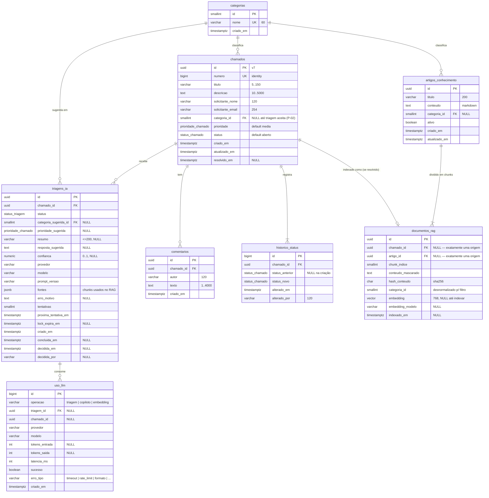

# Modelo de dados

> **Fase do checklist:** 3. Modelagem de dados (atualização do ADD)
> **Banco:** PostgreSQL + extensões `vector`, `pg_trgm` e `unaccent`
> **Decisões relacionadas:** [ADR-0007](adr/0007-pgvector-no-postgres.md), [ADR-0008](adr/0008-busca-textual-pg-trgm.md), [ADR-0009](adr/0009-sql-explicito-no-dashboard.md), [ADR-0010](adr/0010-filas-derivadas-do-estado.md), [ADR-0011](adr/0011-estrategia-de-embeddings.md)

## 1. Convenções

| Convenção | Regra | Motivo |
|---|---|---|
| Nomes | Tabelas e colunas em `snake_case` e no plural (`chamados`, `criado_em`). | É o padrão do PostgreSQL e dispensa aspas no SQL escrito à mão (ADR-0009). No C#, as propriedades continuam em PascalCase, via convenção de nomes no EF Core. |
| Chaves | `uuid` **v7** nas entidades expostas pela API. `smallint` em `categorias`. `bigint identity` nos registros de log (`historico_status`, `uso_llm`). | O UUID v7 é ordenado no tempo, o que dá boa localidade no índice B-tree e não expõe volume nem permite enumeração. É gerado na aplicação (`Guid.CreateVersion7()`). |
| Número amigável | `chamados.numero bigint GENERATED ALWAYS AS IDENTITY` (exibido como `#1042`). | Humanos não falam UUID. |
| Datas | Sempre `timestamptz`, gravado em UTC. | Evita ambiguidade de fuso. A conversão para o horário local é feita no frontend. |
| Enums | Enums nativos do PostgreSQL. | Integridade no banco e **ordem de declaração = ordem de negócio**: `ORDER BY prioridade` já ordena Baixa < Média < Alta < Crítica (P-07) sem `CASE`. |
| Concorrência | Concorrência otimista via `xmin` (coluna de sistema do Postgres), usada como token no EF Core. | Dois atendentes mudando o status ao mesmo tempo → o segundo recebe **409**. |
| Textos | Limites de tamanho com `CHECK`, e não só na API. | O banco é a última linha de defesa da integridade. |

## 2. Diagrama entidade-relacionamento



Entidades que vão **além** do enunciado, e o motivo de cada uma:

| Entidade/campo | Por quê |
|---|---|
| `artigos_conhecimento` | Base de conhecimento do RAG (RF-30). |
| `documentos_rag` | Unidade de indexação vetorial (ADR-0011). |
| `uso_llm` | Controle de custo e observabilidade de **toda** chamada ao LLM, incluindo o copiloto e os embeddings (RF-17, NFR-11, NFR-12). A triagem guarda só o resultado; o consumo fica no livro-razão. |
| `triagens_ia.fontes`, `prompt_versao`, `provedor` | Rastreabilidade: saber qual prompt, qual modelo e quais documentos geraram cada sugestão. |
| Colunas de fila em `triagens_ia` | Fila derivada do estado (ADR-0010). |
| `chamados.numero` | Identificador amigável para humanos. |

## 3. Tipos enumerados

```sql
CREATE TYPE status_chamado     AS ENUM ('aberto', 'em_andamento', 'resolvido', 'fechado', 'cancelado');
CREATE TYPE prioridade_chamado AS ENUM ('baixa', 'media', 'alta', 'critica');   -- ordem = ordem de negócio
CREATE TYPE status_triagem     AS ENUM ('pendente', 'concluida', 'falhou', 'aceita', 'rejeitada');
```

A API expõe os valores do enunciado (`Aberto`, `EmAndamento`, `Média`...) por meio de conversores. O banco usa identificadores sem acento.

## 4. Constraints de integridade

Além de PK, FK e `NOT NULL`, estas são as regras de negócio garantidas **pelo banco**:

```sql
-- chamados
CHECK (char_length(titulo) BETWEEN 5 AND 150)
CHECK (char_length(descricao) BETWEEN 10 AND 5000)
CHECK (solicitante_email ~* '^[^@\s]+@[^@\s]+\.[^@\s]+$')             -- validação completa fica na API
CHECK ((resolvido_em IS NOT NULL) = (status IN ('resolvido', 'fechado')))  -- RN-03
CHECK (resolvido_em IS NULL OR resolvido_em >= criado_em)
CHECK (NOT (prioridade = 'critica' AND status = 'cancelado'))         -- RN-05, até para escrita fora da API

-- historico_status
CHECK (status_anterior IS DISTINCT FROM status_novo)                  -- RN-06

-- triagens_ia
CHECK (confianca IS NULL OR confianca BETWEEN 0 AND 1)
CHECK (resumo IS NULL OR char_length(resumo) <= 200)
CHECK (status NOT IN ('concluida', 'aceita', 'rejeitada')              -- sugestão completa quando válida
       OR (categoria_sugerida_id IS NOT NULL AND prioridade_sugerida IS NOT NULL
           AND resumo IS NOT NULL AND resposta_sugerida IS NOT NULL AND confianca IS NOT NULL))
CHECK (status <> 'falhou' OR erro_motivo IS NOT NULL)
CHECK ((status IN ('aceita', 'rejeitada')) = (decidida_em IS NOT NULL))

-- documentos_rag
CHECK (num_nonnulls(chamado_id, artigo_id) = 1)                       -- exatamente uma origem
CHECK ((embedding IS NULL) = (embedding_modelo IS NULL))
UNIQUE NULLS NOT DISTINCT (chamado_id, artigo_id, chunk_indice)
```

Política de exclusão: `ON DELETE CASCADE` de `chamados` para comentários, histórico, triagens e documentos, e de `artigos_conhecimento` para documentos. `categorias` usa `ON DELETE RESTRICT`, porque não se apaga uma categoria em uso.

**A máquina de estados (RN-01) não está no banco.** Um trigger duplicaria a regra do domínio em outra linguagem. O banco garante as *consequências* verificáveis (`resolvido_em` coerente, Crítica nunca cancelada), e o domínio garante as *transições*. Os testes cobrem as duas camadas.

## 5. Índices e justificativas

O objetivo é atender aos filtros e ordenações de `GET /api/chamados`, às consultas das filas e à busca vetorial. Não criamos um índice por combinação de filtros: o planner combina índices com *bitmap AND*, e índices demais degradam as escritas.

| # | Índice | Atende | Justificativa |
|---|---|---|---|
| 1 | `chamados (criado_em DESC, id DESC)` | Ordenação padrão (mais recentes), filtro por **período** | É o caminho mais comum da listagem. O `id` desempata a ordenação, deixando a paginação estável. O filtro de período vira um *range scan* no mesmo índice. |
| 2 | `chamados (status, criado_em DESC)` | Filtro por **status** + ordenação por data | "Chamados abertos" é o filtro mais usado. Com o `status` na frente, o índice entrega as linhas já ordenadas, sem sort. Também atende o `GROUP BY status` do dashboard via *index-only scan*. |
| 3 | `chamados (prioridade DESC, criado_em DESC)` | Ordenação e filtro por **prioridade** | O enum ordena corretamente (P-07). Atende "Críticas primeiro" sem sort e o filtro `prioridade = X`. |
| 4 | `chamados (categoria_id, criado_em DESC)` | Filtro por **categoria** e FK | O PostgreSQL **não** cria índices em FKs automaticamente. Este índice evita *seq scan* no filtro e no `ON DELETE RESTRICT` de categorias. |
| 5 | `chamados USING gin (f_unaccent(lower(titulo \|\| ' ' \|\| descricao)) gin_trgm_ops)` | Busca por **texto** (`q`) | É o que torna `LIKE '%termo%'` indexável e insensível a acento (ADR-0008). |
| 6 | `comentarios (chamado_id, criado_em)` | Detalhe do chamado | É a FK mais a ordem cronológica de exibição. |
| 7 | `historico_status (chamado_id, alterado_em)` | Detalhe do chamado | O mesmo raciocínio do #6. |
| 8 | `triagens_ia (chamado_id, criado_em DESC)` | Triagem **vigente** (a mais recente, P-04) | `ORDER BY criado_em DESC LIMIT 1` por chamado. |
| 9 | `triagens_ia (proxima_tentativa_em) WHERE status = 'pendente'` | **Fila** do worker | É um índice parcial: contém só as triagens pendentes, então fica minúsculo mesmo com milhões de triagens históricas (ADR-0010). |
| 10 | `UNIQUE triagens_ia (chamado_id) WHERE status = 'pendente'` | Regra: 1 pendente por chamado | Garante no banco que "Refazer" durante uma triagem pendente é impossível → **409**. |
| 11 | `documentos_rag USING hnsw (embedding vector_cosine_ops)` | Busca **semântica** (RAG e copiloto) | ANN com latência de milissegundos (ADR-0007). HNSW em vez de IVFFlat porque dispensa treino com dados prévios e mantém boa qualidade com inserts incrementais. |
| 12 | `documentos_rag (indexado_em) WHERE embedding IS NULL` | **Fila** de indexação | Um índice parcial para o reconciliador achar rápido o que falta indexar. |
| 13 | `documentos_rag (chamado_id)` e `(artigo_id)` | FKs + reconciliação | O reconciliador compara a origem com o documento. Também serve ao `ON DELETE CASCADE`. |
| 14 | `uso_llm (criado_em)` | Métricas de custo por período | As consultas de consumo são sempre por janela de tempo. |

**Índices deliberadamente não criados:**

| Candidato | Por que não |
|---|---|
| `triagens_ia (status)` | A taxa de aceitação agrega triagens decididas. Com baixa seletividade e tabela pequena, um *seq scan* é mais barato. Seria reavaliado com `EXPLAIN` em volume real. |
| Índice por cada combinação de filtros (status + prioridade + categoria) | Custo de escrita alto e ganho marginal. O planner combina os índices 2, 3 e 4 via bitmap. |
| Full-text (`tsvector`) | É fora de escopo pelo ADR-0008. |

## 6. Consultas do dashboard (SQL explícito, ADR-0009)

```sql
-- 1) Totais por status e por prioridade (uma varredura só)
SELECT 'status' AS dimensao, status::text AS valor, COUNT(*) AS total
FROM chamados GROUP BY status
UNION ALL
SELECT 'prioridade', prioridade::text, COUNT(*)
FROM chamados GROUP BY prioridade;

-- 2) Tempo médio de resolução (horas) por categoria — RN-13
SELECT c.id AS categoria_id, c.nome AS categoria,
       COUNT(ch.id) AS resolvidos,
       ROUND(AVG(EXTRACT(EPOCH FROM (ch.resolvido_em - ch.criado_em)) / 3600.0)::numeric, 1)
         AS tempo_medio_horas
FROM categorias c
LEFT JOIN chamados ch ON ch.categoria_id = c.id AND ch.resolvido_em IS NOT NULL
GROUP BY c.id, c.nome
ORDER BY c.nome;

-- 3) Taxa de aceitação geral + aceitas x rejeitadas por categoria sugerida — RN-12, RF-43
SELECT c.nome AS categoria,
       COUNT(*) FILTER (WHERE t.status = 'aceita')    AS aceitas,
       COUNT(*) FILTER (WHERE t.status = 'rejeitada') AS rejeitadas,
       ROUND(COUNT(*) FILTER (WHERE t.status = 'aceita')::numeric
             / NULLIF(COUNT(*) FILTER (WHERE t.status IN ('aceita', 'rejeitada')), 0), 3)
         AS taxa_aceitacao
FROM triagens_ia t
JOIN categorias c ON c.id = t.categoria_sugerida_id
WHERE t.status IN ('aceita', 'rejeitada')
GROUP BY ROLLUP (c.nome)      -- a linha com categoria NULL é o total geral
ORDER BY c.nome NULLS LAST;

-- 4) Consumo de IA (diferencial de custo) — últimos 30 dias
SELECT operacao, modelo,
       COUNT(*) AS chamadas,
       COUNT(*) FILTER (WHERE NOT sucesso) AS falhas,
       SUM(tokens_entrada) AS tokens_entrada,
       SUM(tokens_saida)   AS tokens_saida,
       PERCENTILE_CONT(0.95) WITHIN GROUP (ORDER BY latencia_ms) AS latencia_p95_ms
FROM uso_llm
WHERE criado_em >= now() - interval '30 days'
GROUP BY operacao, modelo;
```

O endpoint executa as quatro consultas numa única conexão e as compõe na resposta. Nenhuma linha de chamado individual trafega para a aplicação.

## 7. Seed

| Dado | Volume | Regra |
|---|---|---|
| Categorias | 5 | Acesso/Login, Financeiro, Bug no sistema, Dúvida, Infraestrutura. |
| Chamados | ~200 | Distribuídos nos últimos 90 dias, com todas as combinações de status e prioridade. Os que estão em `resolvido`/`fechado` têm `resolvido_em` coerente (de 1 h a 10 dias depois). Cada chamado tem o `historico_status` consistente com seu status atual. |
| Comentários | 1–5 por chamado | Os resolvidos têm um comentário de resolução, que é o insumo do RAG. |
| Triagens | ~70% dos chamados | Status variados (aceitas, rejeitadas, concluídas, falhas), para que o dashboard e o painel tenham dados. |
| Artigos | ~25 | Procedimentos e FAQs por categoria, em Markdown com seções (para exercitar o chunking). |
| Dados pessoais | Todos fictícios | Nomes e e-mails em domínio `example.com` (RFC 2606). Algumas descrições contêm **CPFs, telefones e e-mails falsos de propósito**, para demonstrar o mascaramento. |

- O seed é **gerado por código com semente fixa** (Bogus, `Randomizer.Seed = 42`): reprodutível, sem SQL gigante no repositório.
- Os textos de chamado e artigo vêm de **modelos escritos à mão** por categoria (realistas, em português), combinados com variações. Não são gerados por LLM em tempo de execução.
- O seed é idempotente: só roda se `chamados` estiver vazia.
- Os **embeddings não fazem parte do seed**. O reconciliador indexa tudo após a subida (ADR-0010), então o seed funciona com qualquer provedor.
